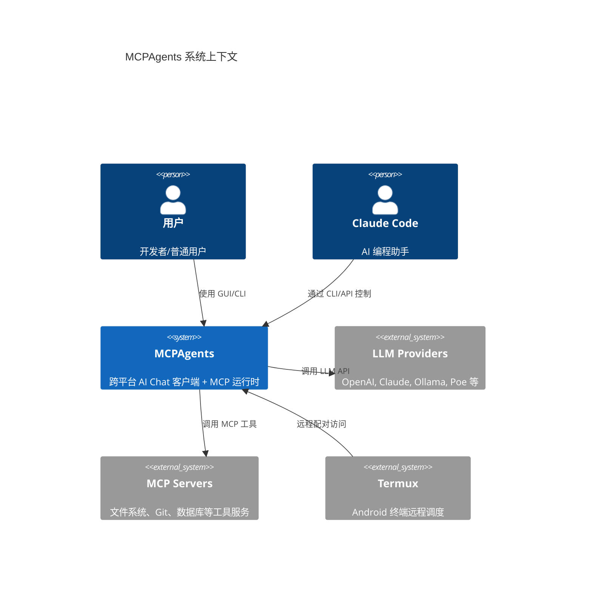
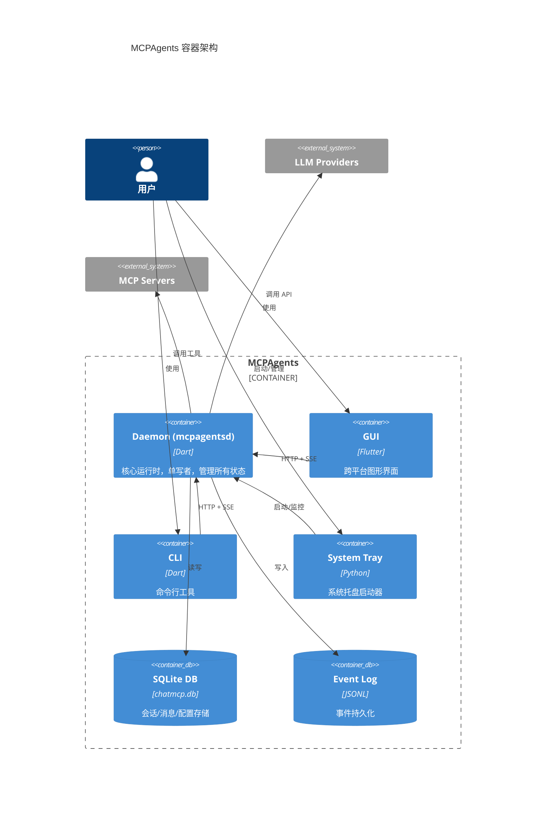
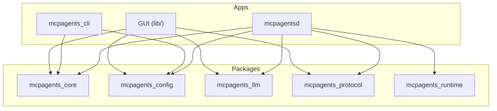
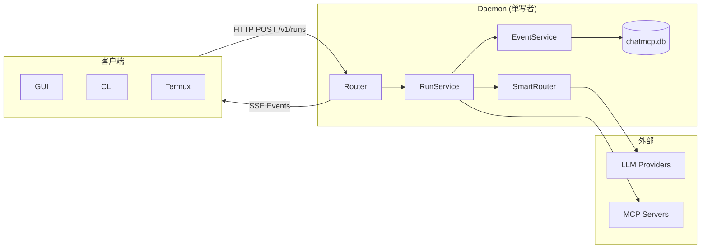

# MCPAgents 项目结构说明书

> 本文档描述 MCPAgents 项目的整体结构、模块划分及依赖关系，帮助开发者快速建立全局认知。

**项目版本**: 0.5.6 | **本机配置**: ROG Strix G634JY / i9-13980HX / 64GB RAM / RTX 4090 Laptop

---

## 1. Purpose（目的）

### 解决什么问题
- 提供项目结构的全局视图和模块地图
- 明确核心模块与扩展模块的边界
- 帮助新开发者快速定位代码位置

### 不解决什么问题
- 不涉及具体模块的实现细节（参见各模块专属文档）
- 不涉及 API 规范（参见 `docs/DAEMON_DEVELOPMENT_GUIDE.md`）

---

## 2. 架构概览 (C4 Model)

### 2.1 C4 Context - 系统上下文



### 2.2 C4 Container - 容器划分



---

## 3. 目录结构

```
D:\claude1\MCPAgents\
├── apps/                           # 应用程序
│   ├── mcpagentsd/                 # Daemon 核心服务
│   │   ├── bin/
│   │   │   ├── main.dart           # 入口
│   │   │   ├── mcpagentsd.exe      # 编译后可执行文件
│   │   │   ├── mcpagentsd_tray.py  # 托盘源码
│   │   │   └── mcpagentsd_tray.exe # 托盘程序
│   │   ├── lib/
│   │   │   ├── daemon.dart         # Daemon 主类
│   │   │   └── src/
│   │   │       ├── router.dart     # HTTP 路由 (SSE 断线续传)
│   │   │       ├── services/       # 核心服务层
│   │   │       └── utils/          # 工具类
│   │   └── test/                   # 单元/E2E 测试
│   └── mcpagents_cli/              # CLI 命令行工具
│       ├── bin/main.dart
│       └── lib/commands/           # 命令实现
│
├── packages/                       # 共享包
│   ├── mcpagents_config/           # 配置管理
│   ├── mcpagents_core/             # 核心功能 (events, errors, models)
│   ├── mcpagents_llm/              # LLM 集成
│   ├── mcpagents_protocol/         # MCP 协议
│   └── mcpagents_runtime/          # 运行时
│
├── lib/                            # Flutter GUI 源码
│   ├── main.dart                   # GUI 入口
│   ├── llm/                        # LLM 客户端 (14 个 Provider)
│   ├── mcp/                        # MCP 协议实现
│   ├── services/                   # GUI 服务层
│   ├── provider/                   # 状态管理
│   ├── repository/                 # 数据仓库
│   ├── page/                       # 页面组件
│   └── widgets/                    # UI 组件
│
├── docs/                           # 文档
│   ├── guide/                      # 开发指南 (本系列)
│   ├── DAEMON_DEVELOPMENT_GUIDE.md # Daemon 开发文档
│   └── ...                         # 其他文档
│
├── scripts/                        # 脚本
│   ├── setup_tunnel.ps1            # Cloudflare Tunnel 安装
│   ├── verify_daemon.ps1           # Daemon 验证
│   ├── install_systemd.sh          # Linux systemd 安装
│   └── install_launchagent.sh      # macOS LaunchAgent 安装
│
├── assets/                         # 资源文件
│   ├── mcp_server.json             # MCP 服务器配置
│   └── models.json                 # 模型能力配置
│
└── build/                          # 构建产物
    └── windows/x64/runner/Release/ # Windows 可执行文件
```

---

## 4. 模块地图

### 4.1 核心模块 (Core)

| 模块 | 位置 | 职责 |
|------|------|------|
| **Daemon** | `apps/mcpagentsd/` | 中央运行时，单写者，管理所有状态 |
| **Router** | `apps/mcpagentsd/lib/src/router.dart` | HTTP/SSE 路由层 |
| **EventService** | `apps/mcpagentsd/lib/src/services/event_service.dart` | 事件持久化与重放 |
| **RunService** | `apps/mcpagentsd/lib/src/services/run_service.dart` | Run 生命周期管理 |
| **DatabaseService** | `apps/mcpagentsd/lib/src/services/database_service.dart` | SQLite 数据库管理 |
| **SmartRouter** | `apps/mcpagentsd/lib/src/services/smart_router.dart` | 智能路由决策 |

### 4.2 扩展模块 (Extensions)

| 模块 | 状态 | 位置 | 文档 |
|------|------|------|------|
| **托盘** | ✅ 已完成 | `apps/mcpagentsd/bin/mcpagentsd_tray.py` | [30_TRAY.md](extensions/30_TRAY.md) |
| **本地模型** | ✅ 已完成 | `lib/llm/ollama_client.dart` | [31_LOCAL_MODELS.md](extensions/31_LOCAL_MODELS.md) |
| **LLM 集成** | ✅ 已完成 | `lib/llm/`, `apps/mcpagentsd/lib/src/services/poe_provider.dart` | [32_LLM_INTEGRATIONS.md](extensions/32_LLM_INTEGRATIONS.md) |
| **会话 GUI** | ✅ 已完成 | `lib/` | [33_SESSION_GUI.md](extensions/33_SESSION_GUI.md) |
| **桌面 Agents** | 🚧 规划中 | - | [34_DESKTOP_AGENTS.md](extensions/34_DESKTOP_AGENTS.md) |
| **MCP 服务器** | ✅ 已完成 | `lib/mcp/`, `apps/mcpagentsd/lib/src/services/mcp_service.dart` | [35_MCP_SERVERS.md](extensions/35_MCP_SERVERS.md) |
| **安全与隐私** | ✅ 已完成 | `apps/mcpagentsd/lib/src/services/tool_security_service.dart` | [36_SECURITY_PRIVACY.md](extensions/36_SECURITY_PRIVACY.md) |
| **成人/NSFW** | 📋 规划 | - | [37_ADULT_NSFW.md](extensions/37_ADULT_NSFW.md) |

---

## 5. 依赖关系

### 5.1 包依赖图



### 5.2 数据流向



---

## 6. 关键路径速查

| 组件 | 路径 |
|------|------|
| **主 GUI** | `D:\claude1\MCPAgents\lib\main.dart` |
| **GUI 可执行** | `D:\claude1\MCPAgents\build\windows\x64\runner\Release\MCPAgents.exe` |
| **Daemon** | `D:\claude1\MCPAgents\apps\mcpagentsd\bin\main.dart` |
| **Daemon 可执行** | `D:\claude1\MCPAgents\apps\mcpagentsd\bin\mcpagentsd.exe` |
| **托盘程序** | `D:\claude1\MCPAgents\apps\mcpagentsd\bin\mcpagentsd_tray.exe` |
| **CLI** | `D:\claude1\MCPAgents\apps\mcpagents_cli\bin\main.dart` |
| **SmartRouter** | `D:\claude1\MCPAgents\apps\mcpagentsd\lib\src\services\smart_router.dart` |
| **数据库 (Win)** | `%APPDATA%\MCPAgents\chatmcp.db` |
| **数据库 (Linux)** | `~/.local/share/MCPAgents/chatmcp.db` |
| **数据库 (macOS)** | `~/Library/Application Support/MCPAgents/chatmcp.db` |
| **路由配置** | `%APPDATA%\MCPAgents\routing.json` |
| **模型配置** | `%APPDATA%\MCPAgents\models.json` |
| **MCP 配置** | `D:\claude1\MCPAgents\assets\mcp_server.json` |

---

## 7. 平台支持

| 平台 | GUI | CLI | Daemon | 服务化 |
|------|-----|-----|--------|--------|
| **Windows** | ✅ | ✅ | ✅ | 注册表自启动 |
| **Linux** | ✅ | ✅ | ✅ | systemd user/system |
| **macOS** | ✅ | ✅ | ✅ | LaunchAgent |
| **Android** | ✅ | - | - | - |
| **iOS** | ✅ (TestFlight) | - | - | - |
| **Web** | ✅ | - | - | - |

---

## 8. 数据存储位置

| 平台 | 数据目录 | 配置目录 |
|------|----------|----------|
| **Windows** | `%APPDATA%\MCPAgents\` | 同数据目录 |
| **Linux** | `~/.local/share/MCPAgents/` | `~/.config/MCPAgents/` |
| **macOS** | `~/Library/Application Support/MCPAgents/` | 同数据目录 |

### 文件列表

```
%APPDATA%\MCPAgents\
├── chatmcp.db              # SQLite 数据库
├── canonical_config.json   # 统一配置
├── routing.json            # 路由配置
├── models.json             # 模型能力配置 (热重载)
├── daemon_tokens.json      # 鉴权 Token
├── daemon.lock             # 进程锁文件
├── paired_devices.json     # 配对设备列表
├── event_logs/             # 事件日志 (JSONL)
│   └── run_<id>.jsonl
├── checkpoints/            # 检查点文件
└── history_files/          # 对话附件
```

---

## 9. Roadmap

### 已完成
- [x] Daemon/Runtime 架构
- [x] 跨平台 GUI (Flutter)
- [x] CLI 工具
- [x] 系统托盘
- [x] 14 个 LLM Provider 集成
- [x] MCP 协议支持
- [x] 智能路由 (三档策略)
- [x] 企业级特性 (队列/限流/重试/熔断)
- [x] SSE 断线续传
- [x] 远程配对 (Termux)
- [x] Linux/macOS 服务化

### Next
- [ ] 桌面 Agents (控屏/控软件)
- [ ] 会议摘要集成
- [ ] RAG 功能
- [ ] NSFW 扩展模块

---

## 10. 相关文档

- [文档首页](index.md) - 文档入口与阅读路线
- [文档规范](00_DOC_RULES.md) - 写作规范与术语表
- [核心模块](20_CORE_MODULE.md) - 核心模块详解
- [配置参考](reference/config_reference.md) - 完整配置说明
