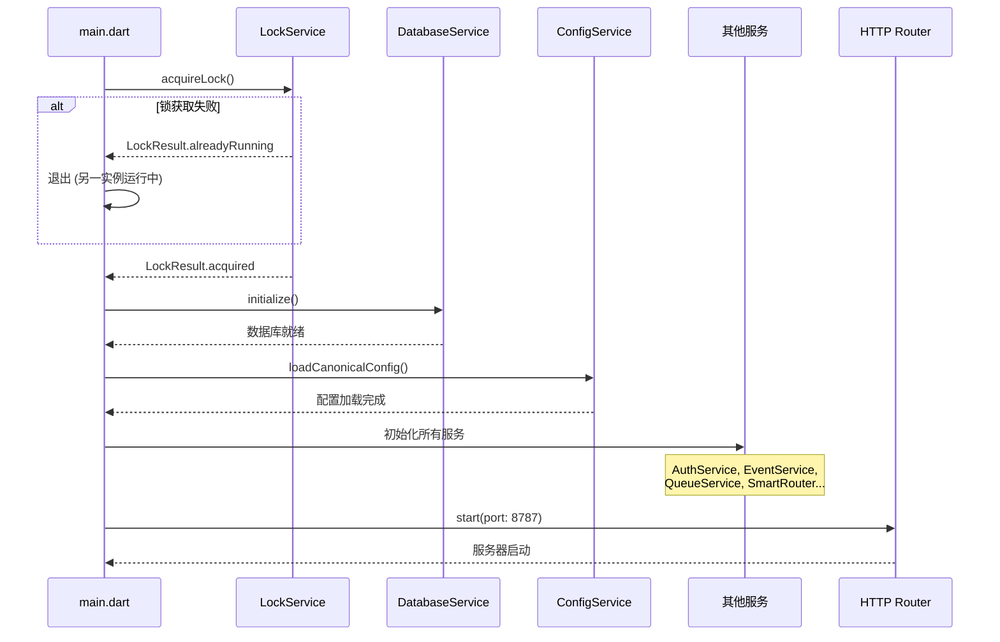
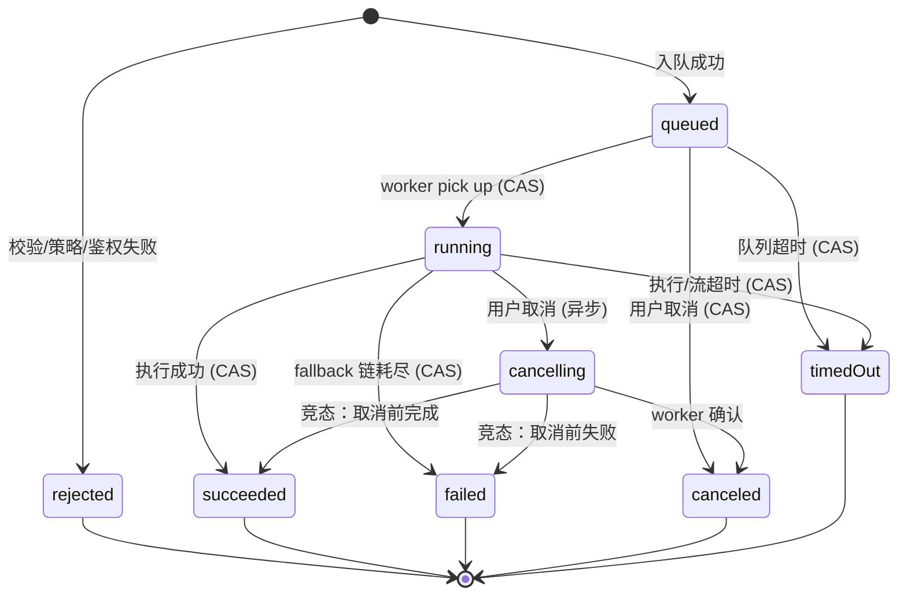

# MCPAgents 核心模块说明书

> 本文档描述 MCPAgents 的核心模块——Daemon/Runtime 的架构、职责和关键不变量。所有扩展模块都依赖于此核心。

**代码位置**: `apps/mcpagentsd/`

---

## 1. Purpose（目的）

### 解决什么问题
- 提供统一的后台服务，作为所有客户端（GUI/CLI/Termux）的 single source of truth
- 实现单写者原则，确保数据一致性
- 管理 LLM 调用的完整生命周期（Run）
- 提供事件驱动的实时通信（SSE）

### 不解决什么问题
- 不直接处理用户界面（由 GUI/CLI 负责）
- 不实现具体的 MCP 工具（由 MCP Servers 提供）
- 不负责模型推理（由 LLM Providers 负责）

---

## 2. Scope & Boundaries（范围与边界）

### 模块归属
**核心模块** - 所有扩展模块都依赖于 Daemon

### 依赖关系
```
Daemon 依赖:
├── packages/mcpagents_core     # 核心数据结构 (Event, Run, Chat)
├── packages/mcpagents_config   # 配置管理
├── packages/mcpagents_llm      # LLM 客户端抽象
├── packages/mcpagents_protocol # MCP 协议
└── packages/mcpagents_runtime  # 运行时工具
```

### 对外暴露能力

| 类型 | 能力 | 端点/接口 |
|------|------|-----------|
| HTTP REST | Run 管理 | `/v1/runs`, `/v1/runs/:id` |
| HTTP REST | Chat 管理 | `/v1/chats`, `/v1/chats/:id` |
| HTTP REST | 配置管理 | `/v1/config`, `/v1/config/providers` |
| HTTP REST | MCP 管理 | `/v1/mcp/servers`, `/v1/mcp/tools` |
| HTTP REST | 健康检查 | `/v1/health`, `/v1/version`, `/v1/capabilities` |
| SSE | 实时事件流 | `/v1/runs/:id/events` |
| SSE | 心跳 | `:heartbeat` (15s 间隔) |

---

## 3. Responsibilities（职责）

1. **启动数据库互斥锁**，确保单实例运行 (`lock_service.dart`)
2. **初始化 SQLite 数据库**，管理 schema 迁移 (`database_service.dart`)
3. **加载统一配置**，提供 canonical config 视图 (`config_service.dart`)
4. **启动 HTTP/SSE 服务器**，处理客户端请求 (`router.dart`)
5. **管理 Run 生命周期**，包括状态机转换 (`run_service.dart`, `run_repository.dart`)
6. **执行智能路由**，选择最佳 Provider/Model (`smart_router.dart`)
7. **调用 LLM Provider**，处理流式响应 (`llm_service.dart`)
8. **管理 MCP Servers**，调用工具 (`mcp_service.dart`)
9. **持久化事件日志**，支持断线续传 (`event_service.dart`)
10. **实施请求限流**，防止资源耗尽 (`queue_service.dart`, `rate_limiter.dart`)
11. **执行弹性重试**，自动 fallback (`resilient_executor.dart`)
12. **验证 Token 鉴权**，保护 API 安全 (`auth_service.dart`)

---

## 4. Architecture（架构）

### 4.1 组件清单

| 组件 | 文件 | 职责 |
|------|------|------|
| **Daemon** | `daemon.dart` | 主入口，初始化所有服务 |
| **Router** | `router.dart` | HTTP 路由，SSE 推流 |
| **RunService** | `run_service.dart` | Run 生命周期管理 |
| **RunRepository** | `run_repository.dart` | Run 持久化，CAS 状态转换 |
| **SmartRouter** | `smart_router.dart` | 智能路由决策 |
| **ResilientExecutor** | `resilient_executor.dart` | 弹性执行，重试/fallback |
| **EventService** | `event_service.dart` | 事件持久化与重放 |
| **QueueService** | `queue_service.dart` | 请求队列，并发控制 |
| **RateLimiter** | `rate_limiter.dart` | Token Bucket + Sliding Window |
| **AuthService** | `auth_service.dart` | Token 鉴权 |
| **LockService** | `lock_service.dart` | 数据库互斥锁 |
| **DatabaseService** | `database_service.dart` | SQLite 管理 |
| **ConfigService** | `config_service.dart` | 配置管理 |
| **MCPService** | `mcp_service.dart` | MCP Server 管理 |
| **LLMService** | `llm_service.dart` | LLM 调用 |
| **PoeProvider** | `poe_provider.dart` | Poe API 集成 |
| **ToolSecurityService** | `tool_security_service.dart` | 工具安全校验 |
| **CheckpointService** | `checkpoint_service.dart` | 检查点/回放 |
| **PairingService** | `pairing_service.dart` | 远程设备配对 |

### 4.2 服务初始化流程



### 4.3 Run 生命周期状态机



### 4.4 关键不变量

| 不变量 | 说明 | 保证机制 |
|--------|------|----------|
| **单写者原则** | Daemon 是 chatmcp.db 的唯一写入者 | `LockService` 互斥锁 |
| **事件可回放** | 所有状态变更都有对应事件 | `EventService` JSONL 持久化 |
| **CAS 状态转换** | 状态变更原子且幂等 | `RunRepository` SQL WHERE 条件 |
| **终态不可变** | succeeded/failed/canceled/timedOut/rejected 不可再变 | 代码逻辑保证 |
| **seq 单调递增** | 每个 Run 的事件序号单调递增 | `EventService` 自增计数器 |

---

## 5. Interfaces（接口）

### 5.1 HTTP REST API

详见 `docs/DAEMON_DEVELOPMENT_GUIDE.md` 第 9 节，主要端点：

| 类别 | 端点 | 说明 |
|------|------|------|
| **健康** | `GET /v1/health` | 健康检查 |
| **版本** | `GET /v1/version` | 版本与功能发现 |
| **Runs** | `POST /v1/runs` | 创建 Run |
| **Runs** | `GET /v1/runs/:id/events` | SSE 事件流 |
| **Runs** | `POST /v1/runs/:id/cancel` | 取消 Run |
| **Chats** | `GET /v1/chats` | 会话列表 |
| **Config** | `GET /v1/config` | 获取配置 |
| **MCP** | `GET /v1/mcp/servers` | MCP 服务器列表 |
| **Stats** | `GET /v1/stats/queue` | 队列统计 |

### 5.2 SSE 事件类型

| 事件 | 说明 | 终态 |
|------|------|------|
| `run.created` | Run 入队 | 否 |
| `run.started` | 开始执行 | 否 |
| `run.succeeded` | 成功完成 | **是** |
| `run.failed` | 执行失败 | **是** |
| `run.canceled` | 已取消 | **是** |
| `run.timed_out` | 超时 | **是** |
| `run.rejected` | 被拒绝 | **是** |
| `llm.delta` | 流式 token | 否 |
| `route.decision` | 路由决策 | 否 |
| `route.fallback` | 切换 fallback | 否 |
| `tool.call.started` | 工具调用开始 | 否 |
| `tool.call.result` | 工具调用结果 | 否 |

### 5.3 事件 ID 格式

```
id: run_abc123:1
event: run.started
data: {"run_id":"run_abc123","seq":1,...}
```

- 格式：`{runId}:{seq}`
- seq 从 1 开始，单调递增
- 用于断线续传（`?after=run_abc123:5` 或 `Last-Event-ID` header）

---

## 6. Data & State（数据与状态）

### 6.1 数据落盘位置

| 数据 | 位置 (Windows) | 格式 |
|------|----------------|------|
| 数据库 | `%APPDATA%\MCPAgents\chatmcp.db` | SQLite |
| 事件日志 | `%APPDATA%\MCPAgents\event_logs\run_*.jsonl` | JSONL |
| 检查点 | `%APPDATA%\MCPAgents\checkpoints\run_*\` | JSONL |
| 配置 | `%APPDATA%\MCPAgents\canonical_config.json` | JSON |
| Token | `%APPDATA%\MCPAgents\daemon_tokens.json` | JSON |
| 进程锁 | `%APPDATA%\MCPAgents\daemon.lock` | 文件锁 |

### 6.2 数据库表结构

主要表（`chatmcp.db`）：

| 表 | 用途 |
|-----|------|
| `chats` | 会话记录 |
| `messages` | 消息记录 |
| `runs` | Run 记录（状态机） |
| `providers` | LLM Provider 配置 |
| `mcp_servers` | MCP Server 配置 |

### 6.3 Run 状态说明

| 状态 | 类型 | 说明 |
|------|------|------|
| `queued` | 中间态 | 已入队，等待执行 |
| `running` | 中间态 | 正在执行 |
| `cancelling` | 中间态 | 取消中 |
| `succeeded` | **终态** | 成功完成 |
| `failed` | **终态** | 执行失败 |
| `canceled` | **终态** | 用户取消 |
| `timedOut` | **终态** | 超时 |
| `rejected` | **终态** | 被拒绝 |

---

## 7. Failure & Recovery（失败与恢复）

### 7.1 错误分类 (`packages/mcpagents_core/lib/src/errors/error_category.dart`)

| 错误类型 | 可重试 | 建议操作 |
|----------|--------|----------|
| `rate_limit` | ✅ | 等待 Retry-After |
| `auth_error` | ❌ | 检查 API Key |
| `quota_exceeded` | ❌ | 升级配额 |
| `server_error` | ✅ | 重试 |
| `network_error` | ✅ | 检查网络 |
| `schema_error` | ❌ | 检查参数 |
| `tool_denied` | ❌ | 检查工具权限 |
| `content_policy` | ❌ | 修改内容 |
| `stream_timeout` | ✅ | 重试 |

### 7.2 重试策略

- **重试预算**: 每 Provider 独立追踪 (`RetryBudget`)
- **退避算法**: `min(baseDelay * 2^attempt, maxDelay) * (1 ± jitter)`
- **默认参数**: maxAttempts=3, baseDelay=1s, maxDelay=30s, jitter=30%

### 7.3 熔断器 (`CircuitBreaker`)

- **模式**: Martin Fowler Circuit Breaker
- **状态**: closed → open → halfOpen
- **参数**: failureThreshold=5, openDuration=30s

### 7.4 Fallback 链

```
用户请求
    ↓
Primary Model (如 gpt-4o)
    ├── 成功 → 返回
    └── 失败 → Fallback 1 (如 claude-sonnet)
                  ├── 成功 → 返回
                  └── 失败 → Fallback 2 (如 qwen3:8b)
                              └── 失败 → Run.failed
```

---

## 8. Security & Privacy（安全与隐私）

### 8.1 权限边界

| 层级 | 保护机制 |
|------|----------|
| **进程级** | 数据库互斥锁 (`LockService`) |
| **API 级** | Bearer Token 鉴权 (`AuthService`) |
| **工具级** | 白名单/路径安全 (`ToolSecurityService`) |

### 8.2 Token Scope

| Scope | 权限 |
|-------|------|
| `read` | 查看 chats, runs, config |
| `config` | 修改配置、providers |
| `run` | 创建/取消 runs |
| `admin` | 完全控制、shutdown |

### 8.3 审计日志

- 所有 Run 状态变更记录到 JSONL
- 敏感内容默认脱敏（`input_hash` 替代原文）
- 工具违规记录到审计事件

### 8.4 最小权限原则

- Termux 配对默认只给 `read` + `run` scope
- 敏感操作需要 `admin` scope
- 工具调用需通过白名单校验

---

## 9. Config（配置）

### 9.1 配置来源

| 配置文件 | 用途 | 热重载 |
|----------|------|--------|
| `canonical_config.json` | 统一配置 | 否 |
| `routing.json` | 路由策略 | ✅ |
| `models.json` | 模型能力 | ✅ |
| `daemon_tokens.json` | 鉴权 Token | 否 |

### 9.2 路由配置示例 (`routing.json`)

```json
{
  "default_mode": "stable_cost",
  "task_mode_overrides": {
    "mcp": "quality_max",
    "mcpParse": "quality_max"
  },
  "privacy_force_local": false,
  "privacy_exclude_providers": ["dashscope", "deepseek", "baidu"]
}
```

### 9.3 默认参数

```dart
String _endpoint = 'http://127.0.0.1:8787';
int _port = 8787;
Duration _queueTimeout = Duration(minutes: 5);
Duration _executionTimeout = Duration(minutes: 10);
Duration _streamTimeout = Duration(seconds: 30);
```

---

## 10. Test（测试）

### 10.1 测试文件

| 文件 | 类型 | 覆盖 |
|------|------|------|
| `e2e_smoke_test.dart` | E2E | 健康检查、Run 生命周期 |
| `smart_router_test.dart` | 单元 | 路由决策、Vision/Audio 检测 |
| `throughput_max_test.dart` | 单元 | 缓存、去重、StrategyPack |
| `p1_9_error_handling_test.dart` | 单元 | 错误分类、重试、熔断 |
| `tool_security_test.dart` | 单元 | 工具安全校验 |

### 10.2 验收脚本

```powershell
# Windows
D:\claude1\MCPAgents\scripts\verify_daemon.ps1

# Linux/macOS
D:\claude1\MCPAgents\scripts\verify_service.sh
```

### 10.3 关键验收点

- [ ] 健康检查返回 `status: healthy`
- [ ] Run 能完成完整生命周期 (queued → running → succeeded)
- [ ] SSE 断线续传正确恢复 (Last-Event-ID)
- [ ] 限流返回 429 + Retry-After
- [ ] 熔断器在连续失败后 open

---

## 11. Roadmap（路线图）

### 已完成 (v0.5.6)
- [x] 单写者架构 (Daemon as single source of truth)
- [x] Run 状态机 (8 种状态)
- [x] SSE 断线续传 (Last-Event-ID + ?after=)
- [x] 智能路由 (三档策略: stable_cost/quality_max/throughput_max)
- [x] 两阶段路由 (Phase A 分类 + Phase B 选择)
- [x] Vision/Audio 能力检测
- [x] 企业级弹性 (队列/限流/重试/熔断)
- [x] 工具安全边界
- [x] 远程配对 (Termux)
- [x] 跨平台服务化 (Windows/Linux/macOS)

### Next
- [ ] Checkpoint 恢复 UI 集成
- [ ] 更多 Provider 支持 (Azure OpenAI, AWS Bedrock)
- [ ] Agent 模式 (多轮工具调用)
- [ ] 会话共享 (P2P)

---

## 12. 相关文档

- [10_PROJECT_STRUCTURE.md](10_PROJECT_STRUCTURE.md) - 项目结构总览
- [DAEMON_DEVELOPMENT_GUIDE.md](../DAEMON_DEVELOPMENT_GUIDE.md) - 完整开发指南
- [extensions/35_MCP_SERVERS.md](extensions/35_MCP_SERVERS.md) - MCP 服务器生态
- [extensions/36_SECURITY_PRIVACY.md](extensions/36_SECURITY_PRIVACY.md) - 安全与隐私
