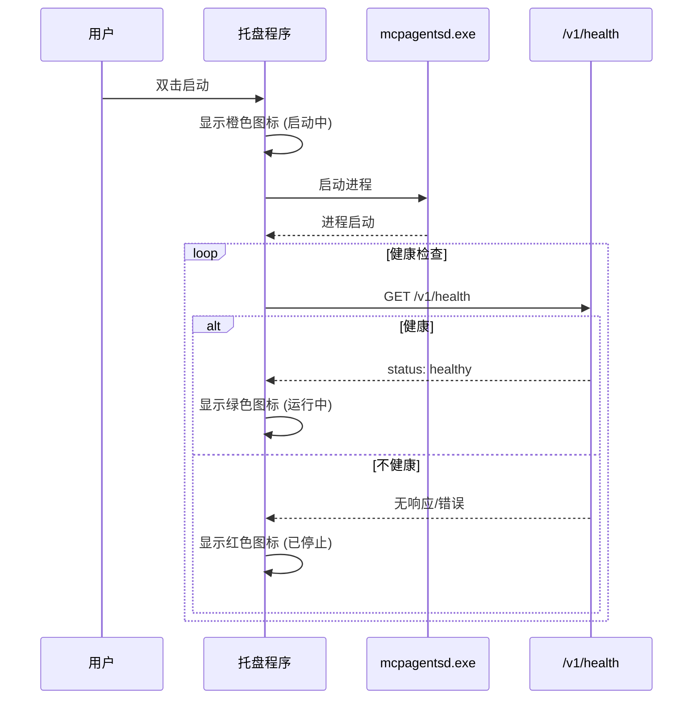

# 托盘/桌面常驻扩展模块

> 系统托盘启动器，提供 Daemon 的后台常驻、开机自启动和快捷管理功能。

**代码位置**: `apps/mcpagentsd/bin/mcpagentsd_tray.py`

---

## 1. Purpose（目的）

### 解决什么问题
- 让 Daemon 在后台常驻运行，无需保持终端窗口
- 提供系统托盘图标，显示运行状态
- 支持开机自启动配置
- 提供快捷菜单管理 Daemon

### 不解决什么问题
- 不负责 Daemon 核心逻辑（由 `mcpagentsd.exe` 负责）
- 不提供 GUI 功能（由 Flutter GUI 负责）

---

## 2. Scope & Boundaries（范围与边界）

### 模块归属
**扩展模块** - 依赖核心 Daemon

### 依赖关系
```
托盘程序依赖:
├── mcpagentsd.exe       # Daemon 可执行文件
├── Python 3.x           # 运行环境
├── pystray              # 托盘库
├── Pillow               # 图标绘制
└── pywin32              # Windows 注册表操作
```

### 对外暴露能力
- 系统托盘图标
- 右键菜单操作
- 开机自启动注册

---

## 3. Responsibilities（职责）

1. **启动 Daemon 进程** (`mcpagentsd.exe`)
2. **显示系统托盘图标**，反映 Daemon 状态
3. **提供右键菜单**，包含常用操作
4. **管理开机自启动**，写入/删除注册表
5. **监控 Daemon 健康**，定期检查 `/v1/health`
6. **重启 Daemon**，在崩溃时自动恢复

---

## 4. Architecture（架构）

### 4.1 组件清单

| 组件 | 职责 |
|------|------|
| `mcpagentsd_tray.py` | 托盘程序源码 |
| `mcpagentsd_tray.exe` | PyInstaller 编译产物 |
| `create_tray_icon()` | 动态绘制状态图标 |
| `DaemonManager` | 进程管理类 |

### 4.2 托盘图标状态

```
     /\        <- V字形天线
    /  \
   ●    ●     <- 天线顶端
    \  /
  ┌──────────┐
  │ ┌──────┐ │
  │ │  ▶   │●│  <- 屏幕 + 状态图标
  │ │  ●●● │●│
  │ │  ■   │ │
  │ └──────┘ │
  └──────────┘
    ▽    ▽    <- 底座
```

| 状态 | 屏幕颜色 | 图标 |
|------|----------|------|
| 运行中 | 绿色 (#4CAF50) | ▶ |
| 启动中 | 橙色 (#FF9800) | ●●● |
| 已停止 | 红色 (#F44336) | ■ |

### 4.3 启动流程



---

## 5. Interfaces（接口）

### 5.1 右键菜单

| 菜单项 | 功能 |
|--------|------|
| **状态** | 显示运行状态、端口、开机启动状态 |
| **打开 GUI** | 启动/唤起 GUI 窗口 (单实例) |
| **重启 Daemon** | 重启 Daemon 进程 |
| **设置/取消开机启动** | 切换开机自启动 |
| **退出** | 停止 Daemon 并退出托盘 |

### 5.2 命令行参数

```bash
mcpagentsd_tray.exe [OPTIONS]

Options:
  --port PORT         Daemon 端口 (default: 8787)
  --poe-key PATH      Poe API Key 文件路径
  --no-autostart      不自动启动 Daemon
```

---

## 6. Data & State（数据与状态）

### 6.1 开机自启动

**注册表位置**: `HKCU\Software\Microsoft\Windows\CurrentVersion\Run`

**条目名**: `MCPAgentsDaemon`

```python
# 验证命令
Get-ItemProperty -Path 'HKCU:\Software\Microsoft\Windows\CurrentVersion\Run' | Select-Object MCPAgentsDaemon
```

### 6.2 状态检查

- 检查间隔: 30 秒
- 端点: `http://127.0.0.1:8787/v1/health`
- 超时: 5 秒

---

## 7. Failure & Recovery（失败与恢复）

### 7.1 Daemon 崩溃

1. 健康检查失败
2. 托盘图标变红
3. 显示通知提示
4. 用户可通过右键菜单重启

### 7.2 端口占用

- 检测端口是否被占用
- 提示用户选择其他端口或关闭占用进程

---

## 8. Security & Privacy（安全与隐私）

### 8.1 权限需求
- 写入注册表 (开机自启动)
- 进程管理 (启动/停止 Daemon)
- 网络访问 (健康检查)

### 8.2 最小权限
- 托盘程序以当前用户权限运行
- 不需要管理员权限

---

## 9. Config（配置）

### 9.1 编译托盘程序

```bash
cd D:\claude1\MCPAgents\apps\mcpagentsd\bin

# 安装依赖
pip install pystray pillow pyinstaller pywin32

# 编译
pyinstaller --onefile --noconsole --name mcpagentsd_tray mcpagentsd_tray.py

# 移动产物
mv dist/mcpagentsd_tray.exe ./
rm -rf build dist *.spec
```

### 9.2 注册表操作

```python
import winreg

STARTUP_REG_PATH = r"Software\Microsoft\Windows\CurrentVersion\Run"
APP_NAME = "MCPAgentsDaemon"

def set_autostart(enable=True):
    key = winreg.OpenKey(
        winreg.HKEY_CURRENT_USER,
        STARTUP_REG_PATH,
        0,
        winreg.KEY_ALL_ACCESS
    )
    if enable:
        exe_path = f'"{sys.executable}"'
        winreg.SetValueEx(key, APP_NAME, 0, winreg.REG_SZ, exe_path)
    else:
        winreg.DeleteValue(key, APP_NAME)
    winreg.CloseKey(key)
```

---

## 10. Test（测试）

### 10.1 手动测试

- [ ] 双击启动托盘程序
- [ ] 验证托盘图标显示正确
- [ ] 右键菜单功能正常
- [ ] 开机自启动设置生效
- [ ] Daemon 崩溃后图标变红

### 10.2 验证开机自启动

```powershell
# 查看注册表
Get-ItemProperty -Path 'HKCU:\Software\Microsoft\Windows\CurrentVersion\Run' | Select-Object MCPAgentsDaemon
```

---

## 11. Roadmap（路线图）

### 已完成
- [x] 托盘图标显示
- [x] 右键菜单
- [x] 开机自启动
- [x] 状态监控
- [x] 打开 GUI (单实例)

### Next
- [ ] 通知气泡 (Daemon 状态变化)
- [ ] 快捷键支持
- [ ] 多语言菜单

---

## 12. 相关文档

- [20_CORE_MODULE.md](../20_CORE_MODULE.md) - Daemon 核心模块
- [DAEMON_DEVELOPMENT_GUIDE.md](../../DAEMON_DEVELOPMENT_GUIDE.md) - 第 7 节 系统托盘
