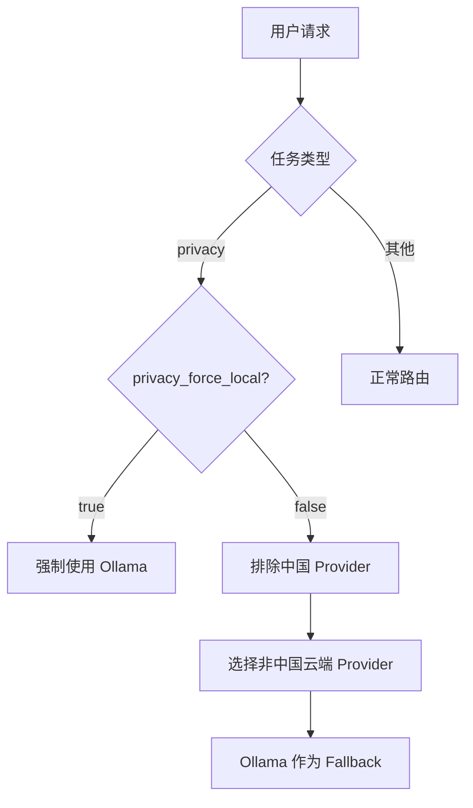

# 本地模型/推理 Worker 扩展模块

> 本地 LLM 推理能力，主要通过 Ollama 提供，支持离线运行和隐私敏感任务。

**代码位置**: `lib/llm/ollama_client.dart`, `apps/mcpagentsd/lib/src/services/smart_router.dart`

---

## 1. Purpose（目的）

### 解决什么问题
- 提供本地 LLM 推理能力，无需网络
- 支持隐私敏感任务（数据不出本机）
- 作为云端 Provider 的 Fallback
- 降低 API 成本（本地推理免费）

### 不解决什么问题
- 不负责模型训练（使用预训练模型）
- 不负责模型下载管理（由 Ollama 负责）
- 不提供最高质量推理（由云端大模型负责）

---

## 2. Scope & Boundaries（范围与边界）

### 模块归属
**扩展模块** - 依赖核心 Daemon

### 依赖关系
```
本地模型依赖:
├── Ollama               # 本地推理服务
│   └── http://localhost:11434
├── 硬件
│   ├── NVIDIA GPU       # RTX 4090 Laptop (16GB VRAM)
│   └── 64GB RAM         # CPU fallback
└── smart_router.dart    # 智能路由集成
```

### 对外暴露能力
- Ollama API 调用
- 本地模型列表
- Vision 模型支持 (llava, bakllava)

---

## 3. Responsibilities（职责）

1. **连接 Ollama 服务** (`http://localhost:11434`)
2. **列出可用模型** (`GET /api/tags`)
3. **发送推理请求** (`POST /api/chat`)
4. **处理流式响应** (SSE 转发)
5. **作为 Fallback 候选**，在云端失败时兜底
6. **处理隐私任务**，当 `privacy_force_local: true`

---

## 4. Architecture（架构）

### 4.1 组件清单

| 组件 | 文件 | 职责 |
|------|------|------|
| **OllamaClient** | `lib/llm/ollama_client.dart` | Ollama API 客户端 |
| **SmartRouter** | `apps/mcpagentsd/lib/src/services/smart_router.dart` | 路由集成 |
| **ModelCapability** | `smart_router.dart:188-253` | 模型能力定义 |

### 4.2 路由优先级

在 `stable_cost` 模式下，Ollama 是第一优先级：

```
stable_cost 模式:
1. ollama (本地/免费)     ← 优先
2. poe (远程聚合)
3. direct providers
```

在 `quality_max` 模式下，Ollama 是最后 fallback：

```
quality_max 模式:
1. 直连 providers (最高质量)
2. poe (远程聚合)
3. ollama (兜底)           ← 最后
```

### 4.3 隐私任务路由



---

## 5. Interfaces（接口）

### 5.1 Ollama API

| 端点 | 方法 | 说明 |
|------|------|------|
| `/api/tags` | GET | 列出本地模型 |
| `/api/chat` | POST | 聊天补全 (流式) |
| `/api/generate` | POST | 文本生成 |
| `/api/embeddings` | POST | 向量嵌入 |

### 5.2 聊天请求示例

```json
POST http://localhost:11434/api/chat
{
  "model": "qwen3:8b",
  "messages": [
    {"role": "user", "content": "Hello"}
  ],
  "stream": true
}
```

### 5.3 响应格式

```json
{"model":"qwen3:8b","message":{"role":"assistant","content":"Hi"},"done":false}
{"model":"qwen3:8b","message":{"role":"assistant","content":"!"},"done":true}
```

---

## 6. Data & State（数据与状态）

### 6.1 模型存储位置

| 平台 | 位置 |
|------|------|
| Windows | `%USERPROFILE%\.ollama\models\` |
| Linux | `~/.ollama/models/` |
| macOS | `~/.ollama/models/` |

### 6.2 推荐模型

| 模型 | 大小 | 用途 | Vision |
|------|------|------|--------|
| `qwen3:8b` | ~4.7GB | 通用任务分类 | ❌ |
| `qwen3:14b` | ~8.4GB | 代码/分析 | ❌ |
| `llava:latest` | ~4.5GB | 图像理解 | ✅ |
| `bakllava:latest` | ~4.5GB | 图像理解 | ✅ |
| `llama3.1:8b` | ~4.7GB | 英文任务 | ❌ |

### 6.3 Model 能力矩阵

```dart
// smart_router.dart - modelCapabilities Map
'ollama:qwen3:8b': ModelCapability(
  provider: 'ollama',
  modelId: 'qwen3:8b',
  supportsVision: false,
  supportsAudio: false,
  supportsTools: false,
  contextWindow: 32768,
  costWeight: 0.0,
),
'ollama:llava:latest': ModelCapability(
  provider: 'ollama',
  modelId: 'llava:latest',
  supportsVision: true,  // Vision 支持
  supportsAudio: false,
  supportsTools: false,
  contextWindow: 4096,
  costWeight: 0.0,
),
```

---

## 7. Failure & Recovery（失败与恢复）

### 7.1 Ollama 未运行

```
错误: Connection refused (localhost:11434)
处理: 自动 fallback 到云端 Provider
```

### 7.2 模型未下载

```
错误: Model 'qwen3:8b' not found
处理:
1. 提示用户运行 `ollama pull qwen3:8b`
2. Fallback 到其他可用模型
```

### 7.3 VRAM 不足

```
错误: CUDA out of memory
处理:
1. 自动切换到较小模型
2. 或 fallback 到云端
```

---

## 8. Security & Privacy（安全与隐私）

### 8.1 隐私保护
- 数据完全本地处理，不出机
- 适合敏感文档分析
- 适合离线环境

### 8.2 配置隐私策略

```json
// routing.json
{
  "privacy_force_local": true,  // 隐私任务强制本地
  "privacy_exclude_providers": [
    "dashscope",
    "deepseek",
    "baidu",
    "moonshot",
    "zhipu"
  ]
}
```

---

## 9. Config（配置）

### 9.1 Ollama 安装

```bash
# Windows (PowerShell)
winget install Ollama.Ollama

# Linux
curl -fsSL https://ollama.com/install.sh | sh

# macOS
brew install ollama
```

### 9.2 下载模型

```bash
# 推荐任务分类模型
ollama pull qwen3:8b

# Vision 模型
ollama pull llava:latest

# 代码模型
ollama pull qwen3:14b
```

### 9.3 启动 Ollama

```bash
# 默认端口 11434
ollama serve

# 自定义端口
OLLAMA_HOST=127.0.0.1:11435 ollama serve
```

### 9.4 GPU 配置

```bash
# 查看 GPU 状态
nvidia-smi

# 限制 VRAM 使用 (可选)
OLLAMA_NUM_GPU=1 ollama serve
```

本机配置：RTX 4090 Laptop (16GB VRAM) 可同时加载多个 7B 模型

---

## 10. Test（测试）

### 10.1 验证 Ollama

```bash
# 检查服务
curl http://localhost:11434/api/tags

# 测试推理
curl http://localhost:11434/api/chat -d '{
  "model": "qwen3:8b",
  "messages": [{"role": "user", "content": "Hello"}]
}'
```

### 10.2 验证路由

```bash
# 发送请求，观察路由决策
curl -X POST http://127.0.0.1:8787/v1/runs \
  -H "Content-Type: application/json" \
  -H "Authorization: Bearer <token>" \
  -d '{"input": {"text": "Hello"}}'
```

### 10.3 验证隐私模式

```bash
# 设置 privacy_force_local: true 后
# 隐私任务应该只使用 Ollama
```

---

## 11. Roadmap（路线图）

### 已完成
- [x] Ollama 客户端集成
- [x] 流式响应支持
- [x] SmartRouter 集成
- [x] Vision 模型支持 (llava)
- [x] 隐私任务强制本地
- [x] Model 级能力收敛

### Next
- [ ] Audio 模型支持 (Whisper)
- [ ] 本地嵌入模型 (embedding)
- [ ] 模型自动下载提示
- [ ] VRAM 使用监控

---

## 12. 相关文档

- [20_CORE_MODULE.md](../20_CORE_MODULE.md) - 核心模块 (SmartRouter)
- [32_LLM_INTEGRATIONS.md](32_LLM_INTEGRATIONS.md) - LLM 集成总览
- [36_SECURITY_PRIVACY.md](36_SECURITY_PRIVACY.md) - 隐私策略
