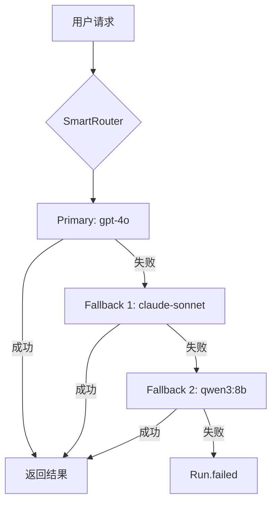

# LLM 集成与自动化开发扩展模块

> 本文档描述 MCPAgents 的多 LLM Provider 集成，包括 14 个 Provider 支持和 Claude Code 自动化开发对接。

**代码位置**: `lib/llm/`, `apps/mcpagentsd/lib/src/services/poe_provider.dart`

---

## 1. Purpose（目的）

### 解决什么问题
- 统一多个 LLM Provider 的接口调用
- 智能选择最佳 Provider/Model
- 支持 Claude Code 等开发工具自动化对接
- 提供 Fallback 链保证可用性

### 不解决什么问题
- 不负责本地模型推理（由 Ollama 负责）
- 不负责具体的 MCP 工具实现

---

## 2. Scope & Boundaries（范围与边界）

### 模块归属
**扩展模块** - 依赖核心 Daemon 和 SmartRouter

### 依赖关系
```
LLM 集成依赖:
├── packages/mcpagents_llm       # LLM 客户端抽象
├── lib/llm/                     # GUI 端 LLM 客户端
├── smart_router.dart            # 路由决策
└── resilient_executor.dart      # 弹性执行
```

### 对外暴露能力
- 14 个 LLM Provider 支持
- 统一的聊天补全接口
- 流式响应
- 工具调用 (Tool Calling)

---

## 3. Responsibilities（职责）

1. **封装 Provider API**，提供统一接口
2. **处理流式响应**，转发 SSE 事件
3. **实现工具调用**，解析 tool_calls
4. **处理认证**，管理 API Keys
5. **适配能力差异**，如 Poe 不支持 strict schema

---

## 4. Architecture（架构）

### 4.1 Provider 清单

| Provider | 文件 | 特点 |
|----------|------|------|
| **OpenAI** | `openai_client.dart` | GPT-4o, 工具调用, Structured Outputs |
| **Claude** | `claude_client.dart` | Claude 3/4, 长上下文 |
| **Google** | `gemini_client.dart` | Gemini, Vision+Audio |
| **Ollama** | `ollama_client.dart` | 本地推理, 免费 |
| **DeepSeek** | `deepseek_client.dart` | 代码专精, 推理模式 |
| **Poe** | `poe_provider.dart` (Daemon) | 聚合入口, 500 RPM |
| **xAI** | `xai_client.dart` | Grok 系列 |
| **Vertex AI** | `vertex_ai_gemini_client.dart` | Google Cloud 托管 |
| **DashScope** | (通过配置) | 阿里通义千问 |
| **Foundry** | `foundry_client.dart` | Microsoft Azure |
| **Copilot** | `copilot_client.dart` | GitHub Copilot |
| **Claude Code** | `claude_code_client.dart` | 自动化开发 |

### 4.2 Provider 能力矩阵

| Provider | 工具调用 | Strict Schema | Structured | Vision | Audio | 成本权重 |
|----------|---------|---------------|------------|--------|-------|----------|
| **ollama** | ❌ | ❌ | ❌ | ✅ (部分) | ❌ | 0.0 |
| **poe** | ✅ | ❌ | ❌ | ✅ | ❌ | 0.3 |
| **openai** | ✅ | ✅ | ✅ | ✅ | ✅ | 0.8 |
| **claude** | ✅ | ✅ | ❌ | ✅ | ❌ | 0.9 |
| **xai** | ✅ | ✅ | ❌ | ✅ | ❌ | 0.5 |
| **google** | ✅ | ❌ | ✅ | ✅ | ✅ | 0.4 |
| **vertex** | ✅ | ❌ | ✅ | ✅ | ✅ | 0.4 |
| **deepseek** | ✅ | ❌ | ❌ | ❌ | ❌ | 0.1 |
| **dashscope** | ✅ | ❌ | ❌ | ✅ | ✅ | 0.2 |

### 4.3 Poe 聚合入口

Poe 作为远程聚合 Provider，提供多模型访问：

```dart
// apps/mcpagentsd/lib/src/services/poe_provider.dart
class PoeProvider {
  static const String baseUrl = 'https://api.poe.com/v1';
  static const int rateLimit = 500; // RPM
}
```

**Poe 限制**:
- `strict: true` 被忽略
- 不支持 Structured Outputs
- 500 RPM 限流

**Daemon 级硬限流**:
```dart
// rate_limiter.dart
final poeBucket = TokenBucket(
  maxTokens: 500,
  refillRate: 500 / 60, // per second
);
```

---

## 5. Interfaces（接口）

### 5.1 统一 LLM 接口

```dart
// lib/llm/base_llm_client.dart
abstract class BaseLLMClient {
  Future<Stream<String>> chatCompletionStream({
    required List<ChatMessage> messages,
    String? model,
    List<Tool>? tools,
    double? temperature,
  });

  Future<String> chatCompletion({
    required List<ChatMessage> messages,
    String? model,
  });
}
```

### 5.2 工具调用格式

```json
// 请求
{
  "model": "gpt-4o",
  "messages": [...],
  "tools": [
    {
      "type": "function",
      "function": {
        "name": "get_weather",
        "parameters": {...}
      }
    }
  ]
}

// 响应
{
  "choices": [{
    "message": {
      "tool_calls": [{
        "id": "call_xxx",
        "function": {
          "name": "get_weather",
          "arguments": "{\"location\": \"北京\"}"
        }
      }]
    }
  }]
}
```

### 5.3 Claude Code 对接

```bash
# CLI 方式
mcpagents run "实现一个排序函数" --model claude-code

# API 方式
POST /v1/runs
{
  "input": {"text": "实现一个排序函数"},
  "options": {
    "preferred_provider": "claude",
    "preferred_model": "claude-code"
  }
}
```

---

## 6. Data & State（数据与状态）

### 6.1 API Key 存储

| Provider | 配置位置 |
|----------|----------|
| OpenAI | `canonical_config.json` → `providers.openai.api_key` |
| Claude | `canonical_config.json` → `providers.claude.api_key` |
| Poe | `D:\tools\AI\poe\poeapikey.txt` (自定义路径) |
| Ollama | 无需 (本地服务) |

### 6.2 Provider 配置示例

```json
// canonical_config.json
{
  "providers": {
    "openai": {
      "enabled": true,
      "api_key": "sk-xxx",
      "base_url": "https://api.openai.com/v1"
    },
    "ollama": {
      "enabled": true,
      "base_url": "http://localhost:11434"
    }
  }
}
```

---

## 7. Failure & Recovery（失败与恢复）

### 7.1 Fallback 链



### 7.2 错误处理

| 错误类型 | 处理 |
|----------|------|
| 429 Rate Limit | 等待 Retry-After，切换 Provider |
| 401 Auth Error | 标记 Provider 不可用，切换 |
| 500 Server Error | 重试 2 次，切换 Provider |
| Timeout | 切换 Provider |

---

## 8. Security & Privacy（安全与隐私）

### 8.1 API Key 保护
- API Key 不记录到日志
- 传输使用 HTTPS
- 本地存储加密 (TODO)

### 8.2 隐私 Provider 排除

```json
// routing.json
{
  "privacy_exclude_providers": [
    "dashscope",  // 阿里
    "deepseek",   // 深度求索
    "baidu",      // 百度
    "moonshot",   // 月之暗面
    "zhipu"       // 智谱
  ]
}
```

---

## 9. Config（配置）

### 9.1 路由策略

```json
// routing.json
{
  "default_mode": "stable_cost",  // 或 quality_max, throughput_max
  "task_mode_overrides": {
    "code": "quality_max",
    "mcp": "quality_max"
  }
}
```

### 9.2 任务类型路由表

| 任务类型 | Primary | Fallback 链 |
|----------|---------|-------------|
| **chat** | gpt-5.2 | gemini-3 → qwen3-max → qwen3:14b |
| **code** | deepseek-reasoner | claude-opus → claude-sonnet |
| **summarize** | deepseek-chat | qwen3-max → qwen3:14b |
| **analysis** | gemini-3-pro | qwen3-max → gpt-5.2 |
| **mcp** | deepseek-chat | qwen3-max → claude-sonnet |

---

## 10. Test（测试）

### 10.1 单元测试

```dart
// test/smart_router_test.dart
test('routes to correct provider based on task type', () async {
  final decision = await router.route(
    messages: [ChatMessage.user('写一个排序函数')],
    availableProviders: {'openai', 'deepseek', 'ollama'},
  );
  expect(decision.provider, equals('deepseek')); // code 任务
});
```

### 10.2 集成测试

```bash
# 测试 OpenAI
curl -X POST http://127.0.0.1:8787/v1/runs \
  -H "Authorization: Bearer <token>" \
  -d '{"input": {"text": "Hello"}, "options": {"preferred_provider": "openai"}}'
```

---

## 11. Roadmap（路线图）

### 已完成
- [x] 14 个 Provider 支持
- [x] 智能路由 (三档策略)
- [x] 两阶段路由 (Phase A + Phase B)
- [x] Vision/Audio 能力检测
- [x] Poe 聚合入口 + 500 RPM 限流
- [x] Fallback 链自动切换
- [x] Model 级能力收敛

### Next
- [ ] Azure OpenAI 支持
- [ ] AWS Bedrock 支持
- [ ] 成本追踪与报告
- [ ] 自定义 Fallback 链配置

---

## 12. 相关文档

- [核心模块](../20_CORE_MODULE.md) - SmartRouter 详解
- [本地模型](31_LOCAL_MODELS.md) - 本地 Ollama 集成
- [配置参考](../reference/config_reference.md) - 路由配置详解
