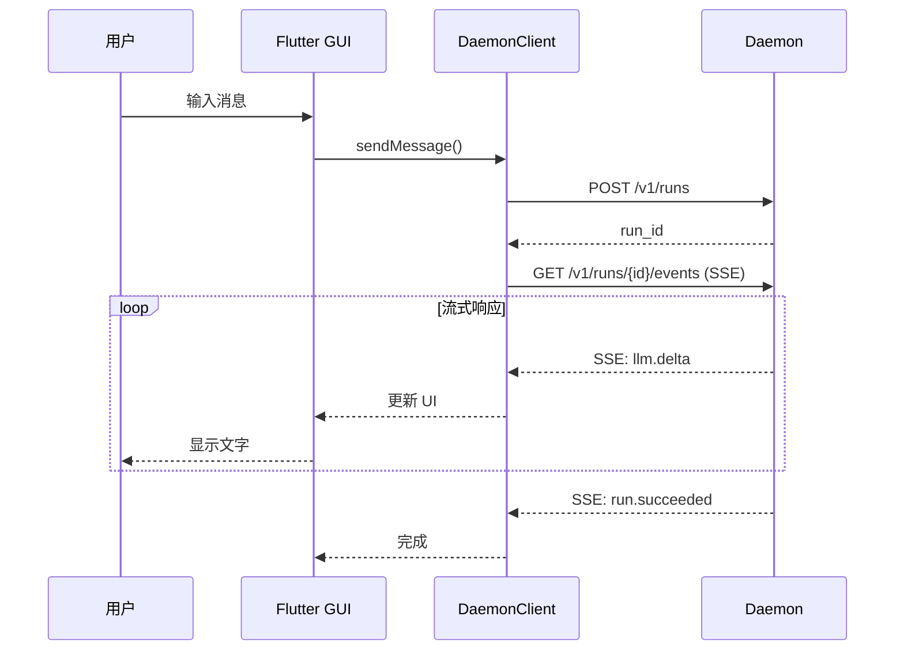
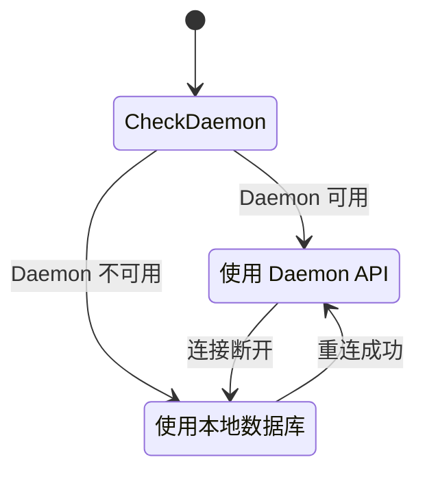

# 会话 GUI 扩展模块

> Flutter 跨平台图形界面，提供会话管理、实时对话、MCP 工具可视化等功能。

**代码位置**: `lib/`

---

## 1. Purpose（目的）

### 解决什么问题
- 提供友好的图形界面进行 AI 对话
- 跨平台支持 (Windows/Linux/macOS/iOS/Android/Web)
- 实时显示 LLM 流式响应
- 可视化 MCP 工具调用
- 管理多会话和历史记录

### 不解决什么问题
- 不负责后台服务（由 Daemon 负责）
- 不负责命令行交互（由 CLI 负责）

---

## 2. Scope & Boundaries（范围与边界）

### 模块归属
**扩展模块** - 依赖核心 Daemon

### 依赖关系
```
GUI 依赖:
├── Daemon (HTTP + SSE)      # 后台服务
│   └── http://127.0.0.1:8787
├── Flutter SDK              # UI 框架
├── packages/mcpagents_core  # 共享数据结构
└── lib/services/daemon_client.dart  # Daemon 通信
```

### 对外暴露能力
- 图形界面交互
- 会话管理
- 配置界面
- MCP Server 市场

---

## 3. Responsibilities（职责）

1. **渲染聊天界面**，支持 Markdown/LaTeX/代码高亮
2. **管理多会话**，支持新建/切换/删除
3. **连接 Daemon**，发送请求和接收 SSE
4. **处理离线模式**，在 Daemon 不可用时本地缓存
5. **显示 MCP 工具调用**，可视化 tool calls
6. **提供配置界面**，管理 Provider/MCP Server
7. **支持数据同步**，局域网多设备同步

---

## 4. Architecture（架构）

### 4.1 目录结构

```
lib/
├── main.dart                    # 入口
├── core/
│   └── router_core.dart         # GUI 路由核心
├── llm/                         # LLM 客户端 (14 个)
│   ├── base_llm_client.dart
│   ├── openai_client.dart
│   └── ...
├── mcp/                         # MCP 协议实现
│   ├── client/
│   ├── stdio/
│   ├── sse/
│   └── models/
├── services/
│   ├── daemon_client.dart       # Daemon 通信
│   ├── smart_router_service.dart
│   ├── offline_sync_service.dart
│   └── pairing_service.dart
├── provider/                    # 状态管理 (Riverpod)
│   ├── daemon_connection_provider.dart
│   ├── task_list_provider.dart
│   └── sse_subscription_mixin.dart
├── repository/
│   ├── chat_repository.dart
│   ├── daemon_chat_repository.dart
│   └── local_chat_repository.dart
├── page/
│   ├── chat/                    # 聊天页面
│   ├── setting/                 # 设置页面
│   ├── mcp/                     # MCP 管理
│   └── run/                     # Run 详情
└── widgets/                     # UI 组件
```

### 4.2 状态管理

使用 Riverpod 进行状态管理：

```dart
// provider/daemon_connection_provider.dart
final daemonConnectionProvider = StateNotifierProvider<DaemonConnectionNotifier, DaemonConnectionState>(...);

// provider/task_list_provider.dart
final taskListProvider = StateNotifierProvider<TaskListNotifier, List<TaskItem>>(...);
```

### 4.3 Daemon 通信流程



### 4.4 SSE 重连策略

```dart
// provider/sse_subscription_mixin.dart
Duration _calculateBackoff() {
  // AWS 推荐: min(baseDelay * 2^attempt, maxDelay) * (1 ± jitter)
  final exponentialMs = baseReconnectDelay.inMilliseconds *
      math.pow(2, _reconnectAttempts - 1);
  final cappedMs = math.min(exponentialMs, maxReconnectDelay.inMilliseconds);
  final jitter = (_random.nextDouble() * 2 - 1) * jitterRange;
  return Duration(milliseconds: (cappedMs + jitter).round());
}
```

参数:
- baseReconnectDelay: 1s
- maxReconnectDelay: 30s
- jitterFactor: 0.1 (±10%)
- maxReconnectAttempts: 10

---

## 5. Interfaces（接口）

### 5.1 DaemonClient API

```dart
// services/daemon_client.dart
class DaemonClient {
  Future<RunResponse> createRun(String text, {String? chatId});
  Stream<SseEvent> streamRunEvents(String runId, {String? lastEventId});
  Future<List<Chat>> getChats();
  Future<Chat> getChat(String id);
  Future<void> deleteChat(String id);
  Future<Config> getConfig();
  Future<void> updateConfig(Config config);
}
```

### 5.2 页面路由

| 路由 | 页面 | 说明 |
|------|------|------|
| `/` | ChatPage | 主聊天页面 |
| `/chat/:id` | ChatPage | 指定会话 |
| `/settings` | SettingsPage | 设置 |
| `/settings/providers` | ProvidersPage | Provider 配置 |
| `/mcp` | McpPage | MCP Server 管理 |
| `/mcp/market` | McpMarketPage | MCP 市场 |
| `/run/:id` | RunDetailPage | Run 详情 |

---

## 6. Data & State（数据与状态）

### 6.1 本地存储

| 平台 | 位置 |
|------|------|
| Windows | `%APPDATA%\ChatMcp\` |
| Linux | `~/.local/share/ChatMcp/` |
| macOS | `~/Library/Application Support/ChatMcp/` |

### 6.2 存储文件

```
%APPDATA%\ChatMcp\
├── chatmcp.db               # 本地数据库 (离线模式)
├── shared_preferences.json  # 应用设置
└── mcp_server.json          # MCP Server 配置
```

### 6.3 离线/在线模式



---

## 7. Failure & Recovery（失败与恢复）

### 7.1 Daemon 不可用

1. 显示连接状态指示器（红色）
2. 切换到离线模式
3. 使用本地数据库和 LLM 客户端
4. 后台持续尝试重连

### 7.2 SSE 断线

1. 保存 lastEventId
2. 指数退避重连
3. 重连后使用 Last-Event-ID 恢复
4. 超过 maxAttempts 后提示用户

---

## 8. Security & Privacy（安全与隐私）

### 8.1 Token 管理
- GUI 启动时从 Daemon 获取 Token
- Token 存储在内存中，不持久化
- 支持 Token 刷新

### 8.2 单实例保护

```cpp
// windows/runner/main.cpp
// 使用 Named Mutex 确保单实例
HANDLE mutex = CreateMutex(NULL, TRUE, L"Global\\MCPAgentsGUI_SingleInstance");
if (GetLastError() == ERROR_ALREADY_EXISTS) {
    // 查找并激活已有窗口
    HWND existingWindow = FindWindow(...);
    SetForegroundWindow(existingWindow);
    return 0;
}
```

---

## 9. Config（配置）

### 9.1 主题配置

```dart
// 支持 Light/Dark 主题
ThemeMode.light
ThemeMode.dark
ThemeMode.system
```

### 9.2 语言配置

支持语言:
- English (en)
- 简体中文 (zh)
- Deutsch (de)
- Türkçe (tr)

### 9.3 渲染配置

```dart
// 消息渲染
- Markdown 支持
- LaTeX 数学公式
- 代码高亮
- Mermaid 图表
- HTML 预览
```

---

## 10. Test（测试）

### 10.1 UAT 测试

UAT 测试脚本：

```bash
# Windows UAT
scripts/uat/windows_admin_uat.ps1

# Linux UAT
scripts/uat/linux_gui_uat.sh
```

### 10.2 关键测试点

- [ ] 新建会话
- [ ] 发送消息并接收响应
- [ ] 流式显示
- [ ] 会话切换
- [ ] 离线模式切换
- [ ] 主题切换
- [ ] MCP 工具调用显示

---

## 11. Roadmap（路线图）

### 已完成
- [x] 跨平台 GUI (6 平台)
- [x] 会话管理
- [x] 流式响应
- [x] Markdown/LaTeX 渲染
- [x] MCP 工具可视化
- [x] 离线模式
- [x] 局域网同步
- [x] Dark/Light 主题
- [x] 多语言支持
- [x] SSE 断线续传

### Next
- [ ] 更好的 UI 设计
- [ ] RAG 功能
- [ ] 语音输入/输出
- [ ] 图片生成预览

---

## 12. 相关文档

- [核心模块](../20_CORE_MODULE.md) - Daemon 核心
- [托盘启动器](30_TRAY.md) - 系统托盘集成
- [故障排查](../runbook/troubleshooting.md) - GUI 问题排查
