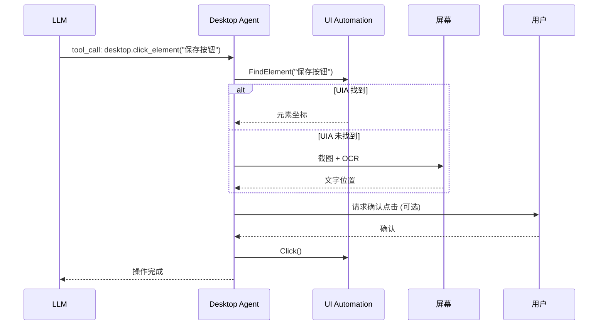

# 桌面 Agents 扩展模块

> 桌面自动化代理，支持控屏、控软件、写文档、改图等能力。

**状态**: 🚧 规划中

---

## 1. Purpose（目的）

### 解决什么问题
- 让 AI 能够操作桌面应用程序
- 自动化文档编辑（Word/Excel/PPT）
- 自动化图像处理
- 自动化软件测试

### 不解决什么问题
- 不负责 LLM 推理（由 Provider 负责）
- 不负责 GUI 界面（由 Flutter GUI 负责）
- 不负责网页自动化（建议使用 Playwright MCP）

---

## 2. Scope & Boundaries（范围与边界）

### 模块归属
**扩展模块** - 依赖核心 Daemon

### 依赖关系
```
桌面 Agents 依赖:
├── Daemon                 # 核心运行时
├── MCP Protocol           # 工具协议
├── Windows UI Automation  # UIA API
├── 图像识别 (fallback)    # OCR + 模板匹配
└── 应用程序 SDK           # Office COM, etc.
```

### 对外暴露能力
- MCP 工具集：`desktop.*`
- 屏幕截图/识别
- 键鼠操作
- 应用控制

---

## 3. Responsibilities（职责）

1. **控制鼠标键盘**，模拟用户输入
2. **截取屏幕**，提供视觉上下文
3. **识别 UI 元素**，优先 UIA，图像识别兜底
4. **操作 Office**，通过 COM 接口
5. **执行复杂工作流**，多步骤自动化

---

## 4. Architecture（架构）

### 4.1 设计原则

| 原则 | 说明 |
|------|------|
| **UIA 优先** | 优先使用 Windows UI Automation API |
| **图像兜底** | UIA 不可用时使用图像识别 |
| **显式授权** | 每个操作需用户确认或白名单 |
| **最小权限** | 只请求必要的系统权限 |
| **可回滚** | 支持操作撤销 |

### 4.2 工具分类

| 类别 | 工具 | 说明 |
|------|------|------|
| **屏幕** | `desktop.screenshot` | 截取屏幕/区域 |
| **屏幕** | `desktop.ocr` | 文字识别 |
| **输入** | `desktop.click` | 鼠标点击 |
| **输入** | `desktop.type` | 键盘输入 |
| **输入** | `desktop.hotkey` | 快捷键 |
| **窗口** | `desktop.find_window` | 查找窗口 |
| **窗口** | `desktop.activate_window` | 激活窗口 |
| **UIA** | `desktop.find_element` | 查找 UI 元素 |
| **UIA** | `desktop.click_element` | 点击元素 |
| **Office** | `desktop.word.*` | Word 操作 |
| **Office** | `desktop.excel.*` | Excel 操作 |
| **Office** | `desktop.ppt.*` | PowerPoint 操作 |

### 4.3 操作流程



---

## 5. Interfaces（接口）

### 5.1 MCP 工具定义 (规划)

```json
{
  "name": "desktop.click_element",
  "description": "点击指定的 UI 元素",
  "inputSchema": {
    "type": "object",
    "properties": {
      "selector": {
        "type": "string",
        "description": "元素选择器 (UIA 或文本匹配)"
      },
      "window": {
        "type": "string",
        "description": "目标窗口标题 (可选)"
      },
      "fallback_to_image": {
        "type": "boolean",
        "default": true,
        "description": "UIA 失败时是否使用图像识别"
      }
    },
    "required": ["selector"]
  }
}
```

### 5.2 Office 工具 (规划)

```json
{
  "name": "desktop.excel.write_cell",
  "description": "写入 Excel 单元格",
  "inputSchema": {
    "type": "object",
    "properties": {
      "file": {"type": "string"},
      "sheet": {"type": "string"},
      "cell": {"type": "string", "pattern": "^[A-Z]+[0-9]+$"},
      "value": {"type": "string"}
    },
    "required": ["file", "cell", "value"]
  }
}
```

---

## 6. Data & State（数据与状态）

### 6.1 截图缓存

```
%APPDATA%\MCPAgents\screenshots\
├── screenshot_20251219_143000.png
└── ...
```

- 默认保留: 1 小时
- 最大空间: 100MB
- 自动清理

### 6.2 操作日志

```json
// event_logs/desktop_actions.jsonl
{"timestamp": "...", "action": "click", "target": "保存按钮", "result": "success"}
```

---

## 7. Failure & Recovery（失败与恢复）

### 7.1 元素未找到

1. 尝试 UIA 查找
2. 失败则截图 + OCR
3. 仍失败则返回错误，请求 LLM 重新描述

### 7.2 操作失败

1. 记录失败状态
2. 截图保存证据
3. 提供回滚建议
4. 返回错误信息给 LLM

---

## 8. Security & Privacy（安全与隐私）

### 8.1 权限控制

| 权限级别 | 操作 | 默认 |
|----------|------|------|
| **低** | 截图、OCR | 允许 |
| **中** | 键鼠输入 | 需确认 |
| **高** | 系统设置、文件删除 | 需显式授权 |

### 8.2 敏感区域保护

- 密码输入框自动遮挡
- 银行/支付应用检测并警告
- 敏感文件路径保护

### 8.3 审计日志

所有桌面操作记录到审计日志：
- 操作类型
- 目标应用/元素
- 操作结果
- 截图证据 (可选)

---

## 9. Config（配置）

### 9.1 启用桌面 Agents (规划)

```json
// canonical_config.json
{
  "desktop_agents": {
    "enabled": false,        // 默认关闭
    "require_confirmation": true,
    "allowed_applications": [
      "notepad.exe",
      "WINWORD.EXE",
      "EXCEL.EXE"
    ],
    "screenshot_retention_minutes": 60
  }
}
```

### 9.2 应用白名单

```json
{
  "desktop_agents": {
    "allowed_applications": [
      "notepad.exe",
      "code.exe",
      "WINWORD.EXE"
    ],
    "blocked_applications": [
      "cmd.exe",
      "powershell.exe"
    ]
  }
}
```

---

## 10. Test（测试）

### 10.1 测试用例 (规划)

- [ ] 打开记事本，输入文字，保存
- [ ] 打开 Excel，写入数据，保存
- [ ] 截图并 OCR 识别文字
- [ ] UIA 元素查找
- [ ] 图像识别 fallback

### 10.2 沙盒测试

建议在虚拟机中测试，避免影响主机：
- Windows Sandbox
- VMware/VirtualBox

---

## 11. Roadmap（路线图）

### 规划 (Next)
- [ ] UIA 元素查找
- [ ] 基础键鼠操作
- [ ] 屏幕截图/OCR
- [ ] 窗口管理

### 未来
- [ ] Office COM 集成
- [ ] 图像识别 (模板匹配)
- [ ] 复杂工作流引擎
- [ ] 操作录制/回放

---

## 12. 相关文档

- [20_CORE_MODULE.md](../20_CORE_MODULE.md) - 核心模块
- [35_MCP_SERVERS.md](35_MCP_SERVERS.md) - MCP 工具生态
- [36_SECURITY_PRIVACY.md](36_SECURITY_PRIVACY.md) - 安全权限

---

## 13. 技术参考

### Windows UI Automation
- [Microsoft UIA Overview](https://learn.microsoft.com/en-us/windows/win32/winauto/entry-uiauto-win32)
- 支持大多数 Windows 应用
- 提供可访问性信息

### 图像识别
- OpenCV 模板匹配
- Tesseract OCR
- YOLO 目标检测 (高级)

### Office 自动化
- COM 接口 (pywin32)
- Open XML SDK
- LibreOffice UNO API (跨平台)
