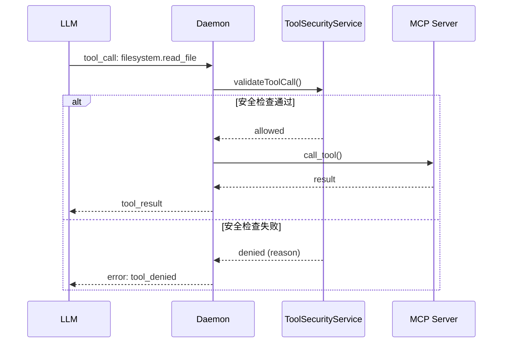
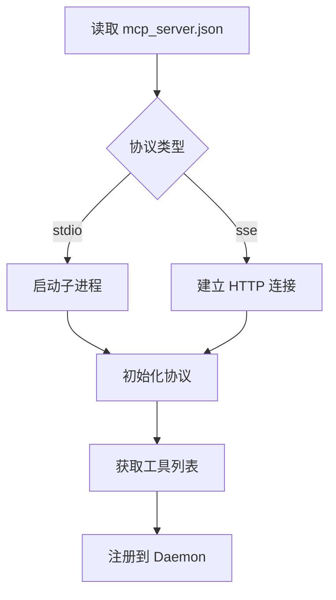

# MCP 服务器生态与安全边界

> Model Context Protocol (MCP) 服务器管理、工具调用和安全策略。

**代码位置**: `lib/mcp/`, `apps/mcpagentsd/lib/src/services/mcp_service.dart`

---

## 1. Purpose（目的）

### 解决什么问题
- 管理多个 MCP Server 的生命周期
- 提供统一的工具调用接口
- 实施工具安全边界
- 支持 Stdio 和 SSE 两种传输协议

### 不解决什么问题
- 不负责具体工具实现（由各 MCP Server 负责）
- 不负责 LLM 推理（由 Provider 负责）

---

## 2. Scope & Boundaries（范围与边界）

### 模块归属
**扩展模块** - 依赖核心 Daemon

### 依赖关系
```
MCP 模块依赖:
├── Daemon                    # 核心运行时
├── packages/mcpagents_protocol  # MCP 协议包
├── ToolSecurityService       # 工具安全
└── 外部 MCP Servers          # uvx/npx 启动
```

### 对外暴露能力
- MCP Server 管理 API
- 工具列表 API
- 工具调用代理

---

## 3. Responsibilities（职责）

1. **启动/停止 MCP Server** 进程
2. **维护 Server 连接**，Stdio/SSE
3. **发现可用工具**，获取 tools 列表
4. **代理工具调用**，校验参数，转发请求
5. **实施安全策略**，白名单/黑名单/路径保护

---

## 4. Architecture（架构）

### 4.1 组件清单

| 组件 | 文件 | 职责 |
|------|------|------|
| **McpService** | `apps/mcpagentsd/lib/src/services/mcp_service.dart` | Server 生命周期 |
| **ToolSecurityService** | `apps/mcpagentsd/lib/src/services/tool_security_service.dart` | 安全校验 |
| **MCP Client** | `lib/mcp/client/` | 协议客户端 |
| **Stdio Transport** | `lib/mcp/stdio/` | 标准 IO 传输 |
| **SSE Transport** | `lib/mcp/sse/` | HTTP SSE 传输 |

### 4.2 MCP 工作流



### 4.3 传输协议

| 协议 | 特点 | 使用场景 |
|------|------|----------|
| **Stdio** | 本地进程，子进程通信 | 本地 MCP Server (uvx/npx) |
| **SSE** | HTTP 长连接，远程支持 | 远程 MCP Server |

### 4.4 Server 启动流程



---

## 5. Interfaces（接口）

### 5.1 MCP 管理 API

| 方法 | 路径 | 说明 |
|------|------|------|
| GET | `/v1/mcp/servers` | 服务器列表 |
| GET | `/v1/mcp/servers/:name` | 服务器状态 |
| POST | `/v1/mcp/servers/:name/start` | 启动服务器 |
| POST | `/v1/mcp/servers/:name/stop` | 停止服务器 |
| POST | `/v1/mcp/servers/:name/restart` | 重启服务器 |
| GET | `/v1/mcp/tools` | 工具列表 |

### 5.2 MCP 配置格式

```json
// assets/mcp_server.json
{
  "mcpServers": {
    "filesystem": {
      "command": "uvx",
      "args": ["mcp-server-filesystem", "--allowed-directories", "/home/user/docs"],
      "env": {}
    },
    "git": {
      "command": "npx",
      "args": ["-y", "@anthropic/mcp-server-git"]
    },
    "remote-server": {
      "url": "http://remote-host:8080/sse",
      "transport": "sse"
    }
  }
}
```

### 5.3 工具调用格式

```json
// 请求
{
  "method": "tools/call",
  "params": {
    "name": "filesystem.read_file",
    "arguments": {
      "path": "/home/user/docs/readme.md"
    }
  }
}

// 响应
{
  "content": [
    {
      "type": "text",
      "text": "# README\n..."
    }
  ]
}
```

---

## 6. Data & State（数据与状态）

### 6.1 配置文件

| 文件 | 位置 | 用途 |
|------|------|------|
| MCP 配置 | `assets/mcp_server.json` | Server 定义 |
| 工具白名单 | `%APPDATA%\MCPAgents\tool_whitelist.json` | 允许的工具 |
| 安全审计 | `event_logs/security_audit.jsonl` | 安全事件 |

### 6.2 Server 状态

| 状态 | 说明 |
|------|------|
| `stopped` | 已停止 |
| `starting` | 启动中 |
| `running` | 运行中 |
| `error` | 错误 |

---

## 7. Failure & Recovery（失败与恢复）

### 7.1 Server 崩溃

1. 检测进程退出
2. 记录错误日志
3. 可选自动重启 (配置)
4. 通知 Daemon 工具不可用

### 7.2 工具调用超时

1. 默认超时: 30 秒
2. 超时后取消请求
3. 返回 timeout 错误

### 7.3 连接断开 (SSE)

1. 尝试重连
2. 指数退避
3. 超过重试次数后标记为 error

---

## 8. Security & Privacy（安全与隐私）

### 8.1 工具安全服务

```dart
// apps/mcpagentsd/lib/src/services/tool_security_service.dart
class ToolSecurityService {
  // 白名单检查
  bool isToolAllowed(String toolName);

  // 路径安全检查
  bool isPathSafe(String path);

  // 参数校验
  ValidationResult validateArguments(String tool, Map<String, dynamic> args);

  // 命令注入检测
  bool hasCommandInjection(String value);
}
```

### 8.2 安全策略

| 策略 | 说明 |
|------|------|
| **白名单** | 只允许配置的工具 |
| **路径保护** | 禁止访问敏感路径 (系统目录、.ssh 等) |
| **参数限制** | 参数大小限制 (默认 1MB) |
| **命令注入** | 检测 shell 命令注入 |
| **审计记录** | 所有调用记录到日志 |

### 8.3 敏感路径保护

```dart
// 默认保护的路径
final sensitivePatterns = [
  r'\.ssh',
  r'\.gnupg',
  r'\.aws',
  r'credentials',
  r'\.env',
  r'password',
  r'secret',
];
```

### 8.4 审计事件

```json
// security_audit.jsonl
{
  "timestamp": "2025-12-19T14:30:00Z",
  "event": "tool_denied",
  "tool": "filesystem.write_file",
  "reason": "path_not_allowed",
  "path": "/etc/passwd",
  "run_id": "run_abc123"
}
```

---

## 9. Config（配置）

### 9.1 全局安全配置

```json
// canonical_config.json
{
  "mcp": {
    "enabled": true,
    "security": {
      "whitelist_mode": true,
      "allowed_tools": ["filesystem.*", "git.*"],
      "blocked_tools": ["shell.*"],
      "max_argument_size_bytes": 1048576,
      "audit_all_calls": true
    }
  }
}
```

### 9.2 Server 特定配置

```json
{
  "mcpServers": {
    "filesystem": {
      "command": "uvx",
      "args": ["mcp-server-filesystem"],
      "security": {
        "allowed_directories": ["/home/user/docs"],
        "read_only": false
      }
    }
  }
}
```

---

## 10. Test（测试）

### 10.1 单元测试

```dart
// apps/mcpagentsd/test/tool_security_test.dart
test('blocks access to sensitive paths', () {
  final service = ToolSecurityService();
  expect(service.isPathSafe('/home/user/.ssh/id_rsa'), isFalse);
  expect(service.isPathSafe('/home/user/docs/readme.md'), isTrue);
});
```

### 10.2 集成测试

```bash
# 启动测试 MCP Server
curl -X POST http://127.0.0.1:8787/v1/mcp/servers/filesystem/start

# 调用工具
curl -X POST http://127.0.0.1:8787/v1/runs \
  -d '{"input": {"text": "读取 /home/user/docs/readme.md"}}'
```

---

## 11. Roadmap（路线图）

### 已完成
- [x] Stdio/SSE 双协议支持
- [x] Server 生命周期管理
- [x] 工具安全边界 (ToolSecurityService)
- [x] 白名单/黑名单
- [x] 路径安全检查
- [x] 命令注入防护
- [x] 审计日志

### Next
- [ ] MCP Server 市场 UI
- [ ] OAuth MCP Servers 支持
- [ ] 工具使用统计
- [ ] 自定义 MCP Server 模板

---

## 12. 相关文档

- [20_CORE_MODULE.md](../20_CORE_MODULE.md) - 核心模块
- [36_SECURITY_PRIVACY.md](36_SECURITY_PRIVACY.md) - 安全策略详解
- [MCP 官方文档](https://modelcontextprotocol.io/introduction)

---

## 13. MCP Server 市场

MCPAgents 集成了 MCP Server 市场，可以一键安装常用 Server：

**市场地址**: https://github.com/chatmcpclient/mcp_server_market

**添加自定义 Server**:
1. Fork 市场仓库
2. 编辑 `mcp_server_market.json`
3. 提交 PR

```json
{
  "mcpServers": {
    "your-mcp-server": {
      "command": "uvx",
      "args": [
        "--from",
        "git+https://github.com/username/your-mcp-server",
        "your-mcp-server"
      ]
    }
  }
}
```
