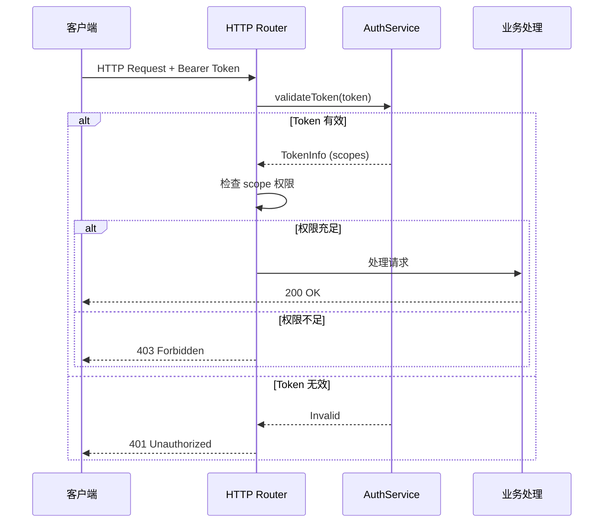
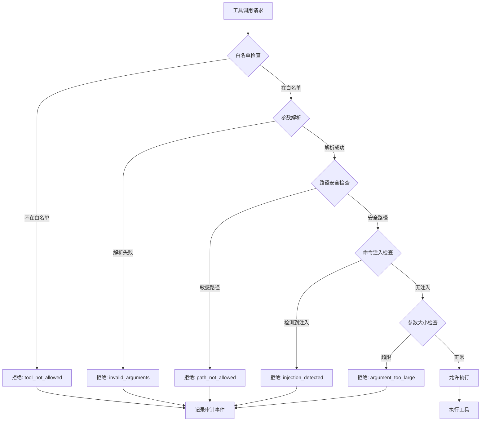

# 安全与隐私扩展模块

> 权限边界、审计日志、隐私保护和数据治理的完整策略文档。

**代码位置**: `apps/mcpagentsd/lib/src/services/tool_security_service.dart`, `auth_service.dart`

---

## 1. Purpose（目的）

### 解决什么问题
- 定义系统的安全边界和权限模型
- 保护用户隐私数据不被泄露
- 提供完整的审计追踪能力
- 实施最小权限原则

### 不解决什么问题
- 不负责加密存储实现（待开发）
- 不负责网络安全（TLS 由基础设施负责）

---

## 2. Scope & Boundaries（范围与边界）

### 模块归属
**扩展模块** - 为整个系统提供安全能力

### 依赖关系
```
安全模块被以下组件使用:
├── Daemon Router          # Token 鉴权
├── MCPService             # 工具安全
├── SmartRouter            # 隐私路由
└── EventService           # 审计日志
```

### 安全层级

```
┌─────────────────────────────────────────┐
│ 应用层: Token 鉴权、Scope 控制          │
├─────────────────────────────────────────┤
│ 工具层: 白名单、路径保护、参数校验       │
├─────────────────────────────────────────┤
│ 数据层: 敏感数据脱敏、审计日志          │
├─────────────────────────────────────────┤
│ 传输层: HTTPS (外部)、localhost (内部)  │
└─────────────────────────────────────────┘
```

---

## 3. Responsibilities（职责）

1. **实施 Token 鉴权**，验证 API 请求合法性
2. **管理权限 Scope**，控制操作范围
3. **执行工具安全检查**，防止危险操作
4. **保护敏感路径**，阻止访问系统文件
5. **脱敏日志数据**，不记录敏感内容
6. **记录审计事件**，支持安全追溯
7. **隐私路由决策**，敏感任务本地处理
8. **数据保留策略**，自动清理过期数据

---

## 4. Architecture（架构）

### 4.1 安全组件清单

| 组件 | 文件 | 职责 |
|------|------|------|
| **AuthService** | `auth_service.dart` | Token 鉴权 |
| **ToolSecurityService** | `tool_security_service.dart` | 工具安全 |
| **EventService** | `event_service.dart` | 审计日志 |
| **SmartRouter** | `smart_router.dart` | 隐私路由 |

### 4.2 Token 鉴权流程



### 4.3 工具安全检查流程



---

## 5. Interfaces（接口）

### 5.1 Token Scope 权限

| Scope | 允许的操作 |
|-------|-----------|
| `read` | GET /v1/chats, /v1/runs, /v1/config |
| `config` | PUT /v1/config, /v1/config/providers |
| `run` | POST /v1/runs, /v1/runs/:id/cancel |
| `admin` | 所有操作，包括 shutdown |

### 5.2 免鉴权端点

以下端点不需要 Token：

| 端点 | 说明 |
|------|------|
| `/v1/health` | 健康检查 |
| `/v1/version` | 版本信息 |
| `/v1/pair` | 设备配对 |

### 5.3 安全相关 API

| 方法 | 路径 | 说明 |
|------|------|------|
| POST | `/v1/pair/token` | 生成配对 Token |
| GET | `/v1/pair/devices` | 已配对设备列表 |
| DELETE | `/v1/pair/devices/:id` | 移除设备 |

---

## 6. Data & State（数据与状态）

### 6.1 安全相关文件

| 文件 | 位置 | 用途 |
|------|------|------|
| Token 存储 | `daemon_tokens.json` | 有效 Token 列表 |
| 配对设备 | `paired_devices.json` | 已配对设备 |
| 工具白名单 | `tool_whitelist.json` | 允许的工具 |
| 审计日志 | `event_logs/*.jsonl` | 审计事件 |

### 6.2 Token 结构

```json
{
  "token": "xxx",
  "created_at": "2025-12-19T00:00:00Z",
  "scopes": ["read", "run"],
  "device_id": "device_123",
  "device_name": "Termux CLI",
  "last_seen_at": "2025-12-19T14:30:00Z"
}
```

### 6.3 审计事件格式

```json
{
  "timestamp": "2025-12-19T14:30:00Z",
  "event_type": "security.tool_denied",
  "run_id": "run_abc123",
  "tool": "filesystem.write_file",
  "reason": "path_not_allowed",
  "details": {
    "path": "/etc/passwd",
    "client_ip": "192.168.1.100"
  }
}
```

---

## 7. Failure & Recovery（失败与恢复）

### 7.1 Token 泄露应对

1. 立即撤销泄露的 Token
2. 生成新 Token
3. 检查审计日志确认影响范围
4. 通知相关用户

```bash
# 撤销 Token
DELETE /v1/pair/devices/:device_id
```

### 7.2 安全事件响应

| 事件类型 | 响应措施 |
|----------|----------|
| 多次认证失败 | 临时锁定 IP (TODO) |
| 敏感路径访问 | 记录审计，拒绝请求 |
| 命令注入尝试 | 记录审计，拒绝请求 |

---

## 8. Security & Privacy（安全与隐私）

### 8.1 最小权限原则

| 设备类型 | 默认 Scope |
|----------|------------|
| termux_cli | read, run |
| mobile_app | read, run, config |
| trusted_cli | read, run, config, admin |

### 8.2 敏感路径保护

默认保护的路径模式：

```dart
final sensitivePatterns = [
  r'\.ssh',           // SSH 密钥
  r'\.gnupg',         // GPG 密钥
  r'\.aws',           // AWS 凭证
  r'credentials',     // 通用凭证
  r'\.env',           // 环境变量
  r'password',        // 密码文件
  r'secret',          // 密钥文件
  r'\.kube',          // Kubernetes 配置
  r'\.docker',        // Docker 配置
  r'id_rsa',          // RSA 私钥
  r'id_ed25519',      // ED25519 私钥
];
```

### 8.3 日志脱敏

| 字段 | 原始 | 脱敏后 |
|------|------|--------|
| input | 完整文本 | input_hash + input_length |
| llm.delta | token 内容 | content_length |
| tool.arguments | 参数 JSON | arguments_hash |
| api_key | sk-xxx | [REDACTED] |

### 8.4 隐私路由

```json
// routing.json
{
  "privacy_force_local": true,  // 隐私任务强制本地
  "privacy_exclude_providers": [
    "dashscope",
    "deepseek",
    "baidu",
    "moonshot",
    "zhipu"
  ]
}
```

当任务类型为 `privacy` 或配置 `privacy_force_local: true` 时：
1. 排除中国 Provider
2. 优先使用 Ollama (本地)
3. Poe 被跳过（可能路由到中国服务器）

---

## 9. Config（配置）

### 9.1 安全配置示例

```json
// canonical_config.json
{
  "security": {
    "require_auth": true,
    "default_scopes": ["read", "run"],
    "token_expiry_days": 30,
    "audit_retention_days": 90
  },
  "mcp": {
    "security": {
      "whitelist_mode": true,
      "allowed_tools": ["filesystem.read_file", "git.*"],
      "blocked_tools": ["shell.*"],
      "max_argument_size_bytes": 1048576,
      "sensitive_path_patterns": ["\\.ssh", "\\.env"]
    }
  }
}
```

### 9.2 事件日志保留

```dart
// event_service.dart
const Duration kDefaultEventLogRetention = Duration(days: 7);

// 清理过期日志
await eventService.runRetentionCleanup();
```

---

## 10. Test（测试）

### 10.1 安全测试用例

```dart
// tool_security_test.dart
group('Path Security', () {
  test('blocks .ssh directory', () {
    expect(service.isPathSafe('/home/user/.ssh/id_rsa'), isFalse);
  });

  test('allows normal paths', () {
    expect(service.isPathSafe('/home/user/docs/readme.md'), isTrue);
  });
});

group('Command Injection', () {
  test('detects shell commands', () {
    expect(service.hasCommandInjection('file.txt; rm -rf /'), isTrue);
  });
});
```

### 10.2 鉴权测试

```bash
# 无 Token 访问 (应返回 401)
curl http://127.0.0.1:8787/v1/runs

# 有效 Token (应成功)
curl -H "Authorization: Bearer <token>" http://127.0.0.1:8787/v1/runs

# Scope 不足 (应返回 403)
curl -H "Authorization: Bearer <read_only_token>" \
  -X POST http://127.0.0.1:8787/v1/runs
```

---

## 11. Roadmap（路线图）

### 已完成
- [x] Token 鉴权 (AuthService)
- [x] Scope 权限控制
- [x] 工具白名单/黑名单
- [x] 路径安全检查
- [x] 命令注入防护
- [x] 参数大小限制
- [x] 审计日志
- [x] 日志脱敏
- [x] 隐私路由 (排除中国 Provider)
- [x] 设备配对 (limited scopes)

### Next
- [ ] Token 过期机制
- [ ] IP 白名单
- [ ] 失败登录锁定
- [ ] 加密存储 (API Keys)
- [ ] 端到端加密 (远程访问)
- [ ] 安全分数报告

---

## 12. 安全检查清单

### 部署前检查

- [ ] 修改默认 Token
- [ ] 配置工具白名单
- [ ] 检查敏感路径保护
- [ ] 启用审计日志
- [ ] 配置日志保留策略
- [ ] 验证隐私路由配置

### 定期审计

- [ ] 检查审计日志异常
- [ ] 清理过期 Token
- [ ] 更新敏感路径模式
- [ ] 检查配对设备列表

---

## 13. 相关文档

- [核心模块](../20_CORE_MODULE.md) - 核心安全机制
- [MCP 服务器](35_MCP_SERVERS.md) - MCP 工具安全
- [NSFW 模块](37_ADULT_NSFW.md) - NSFW 内容安全
- [配置参考](../reference/config_reference.md) - 安全配置详解
