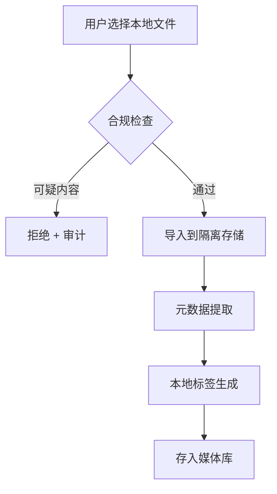

# 成人/NSFW 扩展模块

> NSFW 媒体管理/处理扩展模块，默认关闭、显式启用、强隔离的可选插件。

**状态**: 📋 规划中 | **分发策略**: 独立插件/侧载

---

## 1. Purpose（目的）

### 解决什么问题
- 提供 NSFW 媒体的本地管理和处理能力
- 标签分类、元数据提取
- 本地视频/图像处理（利用 RTX 4090 硬件加速）

### 不解决什么问题
- **不提供** NSFW 内容下载/爬取
- **不提供** 成人网站集成
- **不生成** 色情内容
- **不绕过** 任何内容限制

### 合规底线（硬性要求）
| 禁止类型 | 处理方式 |
|----------|----------|
| 未成年人性内容 | **严禁** - 立即拒绝，记录审计 |
| 非自愿内容 | **严禁** - 立即拒绝，记录审计 |
| 偷拍内容 | **严禁** - 立即拒绝，记录审计 |
| 违法内容 | **严禁** - 立即拒绝，记录审计 |

---

## 2. Scope & Boundaries（范围与边界）

### 模块归属
**可选扩展模块** - 独立于主产品，需显式安装

### 隔离策略
```
┌─────────────────────────────────────────┐
│ 主产品 (App Store / Play Store)         │
│ - 不包含 NSFW 模块                      │
│ - 无 NSFW 相关代码/资源                 │
└─────────────────────────────────────────┘
                    │
                    │ 独立安装
                    ↓
┌─────────────────────────────────────────┐
│ NSFW 插件 (侧载 / 独立发行)             │
│ - 单独的可执行文件/包                   │
│ - 独立的数据存储                        │
│ - 独立的配置文件                        │
└─────────────────────────────────────────┘
```

### 依赖关系
```
NSFW 模块依赖:
├── Daemon                # 核心运行时 (可选)
├── FFmpeg                # 视频处理
├── NVIDIA NVENC          # 硬件编码 (RTX 4090)
├── PyTorch/ONNX          # 本地 ML 推理
└── 本地文件系统          # 存储
```

---

## 3. Responsibilities（职责）

1. **导入本地媒体**，只处理用户自带内容
2. **提取元数据**，分辨率/时长/编码
3. **生成标签**，本地 ML 模型（非露骨摘要）
4. **转码处理**，利用 RTX 4090 NVENC
5. **管理媒体库**，分类/搜索/清理
6. **审计所有操作**，记录详细日志

---

## 4. Architecture（架构）

### 4.1 组件清单 (规划)

| 组件 | 职责 |
|------|------|
| **NSFWPluginService** | 插件入口，生命周期管理 |
| **MediaImporter** | 本地媒体导入 |
| **MetadataExtractor** | 元数据提取 (FFprobe) |
| **LocalTagger** | 本地标签生成 (ONNX) |
| **TranscodeService** | 视频转码 (NVENC) |
| **NSFWAuditService** | 审计日志 |

### 4.2 数据流



### 4.3 Provider 兼容矩阵

| Provider | NSFW 处理能力 | 限制 |
|----------|--------------|------|
| **Ollama (本地)** | ✅ 完全支持 | 无限制 |
| **OpenAI** | ❌ 禁止 | content_policy 拒绝 |
| **Claude** | ❌ 禁止 | content_policy 拒绝 |
| **Poe** | ⚠️ 部分 | 取决于底层模型 |
| **DeepSeek** | ❓ 未知 | 需测试 |

**策略**: 涉及 NSFW 的任务强制使用本地 Ollama，禁用云端 Provider。

---

## 5. Interfaces（接口）

### 5.1 插件 API (规划)

| 端点 | 方法 | 说明 |
|------|------|------|
| `/nsfw/status` | GET | 插件状态 |
| `/nsfw/import` | POST | 导入本地文件 |
| `/nsfw/library` | GET | 媒体库列表 |
| `/nsfw/item/:id` | GET | 媒体详情 |
| `/nsfw/item/:id/tags` | GET | 标签信息 |
| `/nsfw/transcode` | POST | 发起转码 |

### 5.2 启用接口

```json
POST /nsfw/enable
{
  "confirm": true,
  "age_verified": true,
  "accepted_terms": true
}
```

---

## 6. Data & State（数据与状态）

### 6.1 隔离存储

```
%APPDATA%\MCPAgents\nsfw\          # 单独目录
├── config.json                    # 插件配置
├── library.db                     # 独立数据库
├── media\                         # 媒体文件
│   └── [加密存储 - 可选]
├── thumbnails\                    # 缩略图
├── audit.jsonl                    # 审计日志
└── .no_cloud_sync                 # 阻止云同步标记
```

### 6.2 数据治理

| 策略 | 说明 |
|------|------|
| **默认不云同步** | 创建 `.no_cloud_sync` 标记文件 |
| **单独存储区** | 与主数据库完全隔离 |
| **可选加密** | AES-256 加密存储 |
| **不写入主日志** | 独立审计日志文件 |
| **自动清理** | 可配置保留期 |

### 6.3 审计字段

```json
{
  "timestamp": "2025-12-19T14:30:00Z",
  "action": "import",
  "input_source": "local_file",
  "input_path_hash": "sha256:xxx",  // 不记录原始路径
  "output_path_hash": "sha256:yyy",
  "file_size_bytes": 1234567,
  "rejected": false,
  "reject_reason": null
}
```

---

## 7. Failure & Recovery（失败与恢复）

### 7.1 可疑内容检测

1. 本地 ML 模型初筛
2. 检测到可疑内容 → 立即拒绝
3. 记录审计事件（不保存内容）
4. 通知用户

### 7.2 处理失败

1. 转码失败 → 保留原文件
2. 导入失败 → 清理临时文件
3. 数据库损坏 → 从媒体文件重建

---

## 8. Security & Privacy（安全与隐私）

### 8.1 权限需求

| 权限 | 用途 |
|------|------|
| 文件系统 (只读) | 导入用户选择的文件 |
| 文件系统 (写入) | 隔离存储区 |
| GPU 访问 | 视频转码加速 |

### 8.2 审计记录

所有操作都记录，包括：
- 启用/禁用时间
- 导入操作（来源、大小，**不含路径**）
- 拒绝操作（原因）
- 删除操作

### 8.3 年龄验证 (规划)

```json
{
  "age_verification": {
    "required": true,
    "method": "self_declaration",  // 或 "id_verification"
    "verified_at": "2025-12-19T00:00:00Z"
  }
}
```

---

## 9. Config（配置）

### 9.1 插件配置

```json
// %APPDATA%\MCPAgents\nsfw\config.json
{
  "enabled": false,                // 默认关闭
  "require_age_verification": true,
  "storage": {
    "path": "%APPDATA%\\MCPAgents\\nsfw\\media",
    "encryption": false,           // 可选加密
    "max_size_gb": 100,
    "retention_days": null         // null = 永久
  },
  "processing": {
    "use_gpu": true,               // 使用 RTX 4090
    "max_concurrent_tasks": 2
  },
  "audit": {
    "log_all_operations": true,
    "retention_days": 365
  },
  "provider_policy": {
    "force_local_only": true,      // 强制本地处理
    "blocked_providers": ["openai", "claude", "google"]
  }
}
```

### 9.2 主程序配置

```json
// canonical_config.json
{
  "nsfw_plugin": {
    "installed": false,            // 是否已安装
    "path": null                   // 插件路径
  }
}
```

---

## 10. Test（测试）

### 10.1 测试用例 (规划)

- [ ] 插件启用/禁用
- [ ] 本地文件导入
- [ ] 元数据提取
- [ ] 标签生成 (本地模型)
- [ ] 视频转码 (NVENC)
- [ ] 拒绝可疑内容
- [ ] 审计日志完整性

### 10.2 隔离验证

- [ ] 主数据库不包含 NSFW 数据
- [ ] 主日志不包含 NSFW 记录
- [ ] 云同步排除 NSFW 目录

---

## 11. Roadmap（路线图）

### 规划 (Next)
- [ ] 插件架构设计
- [ ] 本地媒体导入
- [ ] 元数据提取 (FFprobe)
- [ ] 基础审计日志

### 未来
- [ ] 本地标签模型
- [ ] NVENC 转码
- [ ] 加密存储
- [ ] 年龄验证集成

---

## 12. 分发策略

### 12.1 平台限制

| 平台 | 内置 NSFW | 说明 |
|------|-----------|------|
| **iOS App Store** | ❌ 禁止 | 违反 App Store 指南 |
| **Google Play** | ❌ 禁止 | 违反内容政策 |
| **Windows Store** | ❌ 禁止 | 违反内容政策 |
| **macOS App Store** | ❌ 禁止 | 违反 App Store 指南 |

### 12.2 分发方案

```
主产品 (商店版)
├── 不包含 NSFW 模块代码
├── 不包含 NSFW 相关资源
└── 配置中隐藏/禁用 NSFW 选项

NSFW 插件 (独立分发)
├── GitHub Releases (开源)
├── 独立网站下载
└── 侧载安装 (APK/ZIP)
```

### 12.3 插件化设计

```dart
// 主程序检测插件
class PluginManager {
  Future<bool> isNSFWPluginInstalled() async {
    final pluginPath = config.nsfw_plugin?.path;
    if (pluginPath == null) return false;
    return File(pluginPath).existsSync();
  }

  Future<void> loadNSFWPlugin() async {
    // 动态加载插件
  }
}
```

---

## 13. 法律合规提醒

> **WARNING**: 在中国大陆，传播淫秽物品是违法行为。本模块仅供个人在合法范围内管理自有内容，不得用于传播。

| 地区 | 法规 | 要求 |
|------|------|------|
| 中国大陆 | 刑法第 364 条 | 禁止传播淫秽物品 |
| 美国 | 18 U.S.C. § 2257 | 年龄验证记录 |
| 欧盟 | GDPR | 数据保护 |
| 日本 | 刑法 175 条 | 禁止传播猥亵物 |

**开发者责任**:
- 只处理用户合法持有的内容
- 提供年龄验证机制
- 严禁未成年人相关内容
- 记录审计日志

---

## 14. 相关文档

- [36_SECURITY_PRIVACY.md](36_SECURITY_PRIVACY.md) - 安全与隐私策略
- [31_LOCAL_MODELS.md](31_LOCAL_MODELS.md) - 本地模型 (无内容限制)
- [10_PROJECT_STRUCTURE.md](../10_PROJECT_STRUCTURE.md) - 项目结构

---

## 15. 本机硬件能力

基于 DxDiag 信息，本机适合 NSFW 媒体处理：

| 组件 | 规格 | 能力 |
|------|------|------|
| **GPU** | RTX 4090 Laptop (16GB VRAM) | NVENC 编码，AV1/HEVC 硬解 |
| **CPU** | i9-13980HX (32 线程) | 多任务处理 |
| **RAM** | 64GB | 大文件处理 |
| **编码支持** | H.264, HEVC, AV1 | 视频转码 |

**推荐工具链**:
- FFmpeg + NVENC: 视频转码
- PyTorch + CUDA: 本地 ML 推理
- ONNX Runtime: 轻量模型部署
